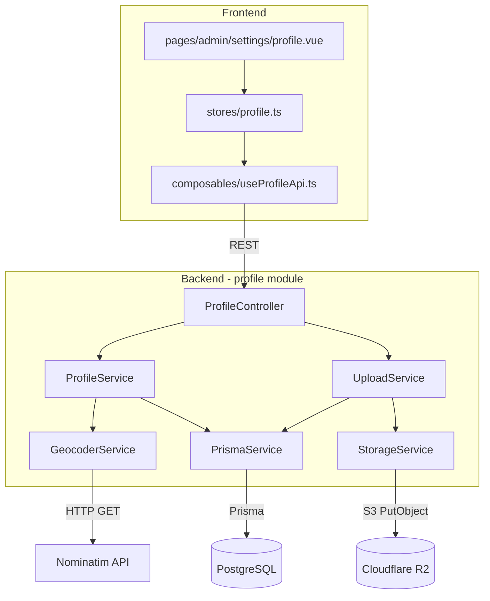

# Design Document: Business Profile Customization

## Overview

This feature extends the existing `Tenant` model and NestJS backend to support full business profile management: logo and banner image uploads to Cloudflare R2, image version history, location management with optional geocoding, and general field updates (name, phone, timezone). A new `profile` module is introduced in the backend, and a settings page is added to the frontend.

The design builds on existing patterns: `TenantGuard` for multi-tenant isolation, `JwtAuthGuard` for authentication, and a new `RolesGuard` for OWNER/ADMIN enforcement. Image uploads use `@aws-sdk/client-s3` with presigned-URL-free server-side streaming. Geocoding uses the Nominatim (OpenStreetMap) API as a free, no-key-required option, with a non-blocking fallback strategy.

---

## Architecture



### Key Design Decisions

- **Separate `profile` module** instead of extending the existing `tenant` module — keeps upload/geocoding concerns isolated and avoids bloating the tenant module.
- **Server-side upload to R2** — the backend receives `multipart/form-data`, validates, and streams to R2 using `@aws-sdk/client-s3` `PutObjectCommand`. No presigned URLs are exposed to the client, keeping R2 credentials server-only.
- **Nominatim for geocoding** — free, no API key required, suitable for a Mexican SMB SaaS. Rate limit is 1 req/s; acceptable since geocoding is triggered only on explicit user save.
- **Non-blocking geocoding** — geocoding runs after address validation. If it fails (network error or no results), the address is saved with `null` coordinates and a warning is returned. The HTTP response is always 200 for this case.
- **Prisma batch transaction** for upload consistency — `prisma.$transaction([...])` groups the `tenant.update` and `imageVersion.create` writes so they succeed or fail atomically.
- **`RolesGuard`** — a new guard that reads a `@Roles()` decorator and checks `request.user.role`. Applied alongside `TenantGuard` on all mutation endpoints.

---

## Components and Interfaces

### Backend Module Structure

```
packages/backend/src/profile/
  profile.module.ts
  profile.controller.ts
  profile.service.ts
  upload.service.ts
  storage.service.ts
  geocoder.service.ts
  profile.service.spec.ts
  upload.service.spec.ts
  dto/
    update-profile.dto.ts
    update-location.dto.ts
    image-version.dto.ts
    upload-response.dto.ts
```

### New Guards and Decorators

```
packages/backend/src/common/guards/roles.guard.ts
packages/backend/src/common/decorators/roles.decorator.ts
```

### REST Endpoints

| Method | Path | Description | Guards |
|--------|------|-------------|--------|
| `GET` | `/profile` | Get current tenant profile | JWT, Tenant |
| `PATCH` | `/profile` | Update name/phone/timezone | JWT, Tenant, Roles(OWNER,ADMIN) |
| `PATCH` | `/profile/location` | Update address + coordinates | JWT, Tenant, Roles(OWNER,ADMIN) |
| `POST` | `/profile/logo` | Upload logo image | JWT, Tenant, Roles(OWNER,ADMIN) |
| `POST` | `/profile/banner` | Upload banner image | JWT, Tenant, Roles(OWNER,ADMIN) |
| `GET` | `/profile/images` | Get image version history | JWT, Tenant |

### ProfileController

```typescript
@Controller('profile')
@UseGuards(JwtAuthGuard, TenantGuard)
export class ProfileController {
  @Get()
  getProfile(@CurrentTenant() tenantId: string): Promise<ProfileDto>

  @Patch()
  @UseGuards(RolesGuard)
  @Roles(Role.OWNER, Role.ADMIN)
  updateProfile(@CurrentTenant() tenantId: string, @Body() dto: UpdateProfileDto): Promise<ProfileDto>

  @Patch('location')
  @UseGuards(RolesGuard)
  @Roles(Role.OWNER, Role.ADMIN)
  updateLocation(@CurrentTenant() tenantId: string, @Body() dto: UpdateLocationDto): Promise<LocationUpdateResponseDto>

  @Post('logo')
  @UseGuards(RolesGuard)
  @Roles(Role.OWNER, Role.ADMIN)
  @UseInterceptors(FileInterceptor('file'))
  uploadLogo(@CurrentTenant() tenantId: string, @UploadedFile() file: Express.Multer.File): Promise<UploadResponseDto>

  @Post('banner')
  @UseGuards(RolesGuard)
  @Roles(Role.OWNER, Role.ADMIN)
  @UseInterceptors(FileInterceptor('file'))
  uploadBanner(@CurrentTenant() tenantId: string, @UploadedFile() file: Express.Multer.File): Promise<UploadResponseDto>

  @Get('images')
  getImageHistory(@CurrentTenant() tenantId: string): Promise<ImageVersionDto[]>
}
```

### StorageService

Wraps `@aws-sdk/client-s3`. Configured via environment variables:

```
R2_ACCOUNT_ID, R2_ACCESS_KEY_ID, R2_SECRET_ACCESS_KEY, R2_BUCKET_NAME, R2_PUBLIC_URL
```

```typescript
interface StorageService {
  upload(key: string, buffer: Buffer, contentType: string): Promise<string>; // returns public URL
}
```

The `upload` method calls `PutObjectCommand` with `ACL: 'public-read'` (or bucket-level public access) and returns `${R2_PUBLIC_URL}/${key}`.

### GeocoderService

```typescript
interface GeocoderResult {
  latitude: number;
  longitude: number;
}

interface GeocoderService {
  geocode(address: string): Promise<GeocoderResult | null>;
}
```

Uses `fetch` to call `https://nominatim.openstreetmap.org/search?q={address}&format=json&limit=1`. Returns `null` on no results or network error. Includes `User-Agent` header as required by Nominatim's usage policy.

---

## Data Models

### Prisma Schema Changes

#### Modified: `Tenant`

Add `bannerUrl` field (the other fields already exist in the schema):

```prisma
model Tenant {
  // ... existing fields ...
  bannerUrl   String?   // NEW

  imageVersions ImageVersion[]  // NEW relation
}
```

#### New: `ImageVersion`

```prisma
enum ImageType {
  LOGO
  BANNER
}

model ImageVersion {
  id        String    @id @default(cuid())
  tenantId  String
  url       String
  fileSize  Int       // bytes
  imageType ImageType
  createdAt DateTime  @default(now())

  tenant Tenant @relation(fields: [tenantId], references: [id], onDelete: Cascade)

  @@index([tenantId, imageType])
  @@index([tenantId, createdAt(sort: Desc)])
}
```

### Shared DTOs (packages/shared/src/dto/profile.dto.ts)

```typescript
export interface ProfileDto {
  id: string;
  name: string;
  slug: string;
  phone: string | null;
  address: string | null;
  logoUrl: string | null;
  bannerUrl: string | null;
  latitude: number | null;
  longitude: number | null;
  timezone: string;
  onboardedAt: string | null;
  trialEndsAt: string;
  isActive: boolean;
}

export interface UpdateProfileDto {
  name?: string;       // 2–100 chars
  phone?: string;      // E.164 format
  timezone?: string;   // IANA identifier
}

export interface UpdateLocationDto {
  address: string;
  latitude?: number;   // -90 to 90
  longitude?: number;  // -180 to 180
}

export interface ImageVersionDto {
  id: string;
  tenantId: string;
  url: string;
  fileSize: number;
  imageType: 'LOGO' | 'BANNER';
  createdAt: string;
}

export interface UploadResponseDto {
  url: string;
  imageVersion: ImageVersionDto;
}

export interface LocationUpdateResponseDto {
  address: string;
  latitude: number | null;
  longitude: number | null;
  geocodingWarning?: string; // present when geocoding was skipped or failed
}
```

### Backend Validation DTOs

```typescript
// update-profile.dto.ts
export class UpdateProfileDto {
  @IsOptional()
  @IsString()
  @Length(2, 100)
  name?: string;

  @IsOptional()
  @Matches(/^\+[1-9]\d{1,14}$/)
  phone?: string;

  @IsOptional()
  @IsTimeZone()
  timezone?: string;
}

// update-location.dto.ts
export class UpdateLocationDto {
  @IsString()
  @IsNotEmpty()
  address: string;

  @IsOptional()
  @IsNumber()
  @Min(-90)
  @Max(90)
  latitude?: number;

  @IsOptional()
  @IsNumber()
  @Min(-180)
  @Max(180)
  longitude?: number;
}
```

---

## Correctness Properties

*A property is a characteristic or behavior that should hold true across all valid executions of a system — essentially, a formal statement about what the system should do. Properties serve as the bridge between human-readable specifications and machine-verifiable correctness guarantees.*

### Property 1: Profile response contains all required fields

*For any* tenant with arbitrary profile data, a GET `/profile` request by an authorized user of that tenant should return a response containing all of: `name`, `phone`, `address`, `logoUrl`, `bannerUrl`, `latitude`, `longitude`, and `timezone` — with `null` as a valid value for optional fields.

**Validates: Requirements 1.1, 1.3, 1.4**

---

### Property 2: Tenant isolation

*For any* two distinct tenants A and B, a user authenticated as a member of tenant A should receive a 403 error when attempting to read or modify the profile of tenant B.

**Validates: Requirements 1.2, 4.3, 7.3, 7.4**

---

### Property 3: Image MIME type validation

*For any* file upload request (logo or banner) where the MIME type is not `image/jpeg` or `image/png`, the Upload_Service should reject the request with a 422 error and no write to Object_Storage should occur.

**Validates: Requirements 2.1, 2.3, 3.1, 3.3**

---

### Property 4: File size limits enforced per image type

*For any* logo upload where the file size exceeds 5 MB, or any banner upload where the file size exceeds 8 MB, the Upload_Service should reject the request with a 422 error and no write to Object_Storage should occur.

**Validates: Requirements 2.2, 3.2**

---

### Property 5: Successful upload creates ImageVersion and updates tenant URL

*For any* valid image upload (logo or banner) that succeeds in Object_Storage, the resulting state should have: (a) a new `ImageVersion` record with the correct `url`, `fileSize`, `imageType`, and `tenantId`; and (b) the corresponding `logoUrl` or `bannerUrl` field on the `Tenant` record updated to the new URL.

**Validates: Requirements 2.4, 2.5, 2.6, 3.4, 3.5, 3.6**

---

### Property 6: Failed upload leaves system state unchanged

*For any* image upload where the Object_Storage write fails, the system should return a 502 error, and neither the `Tenant` record nor any `ImageVersion` record should be created or modified.

**Validates: Requirements 2.7, 2.8, 3.7, 3.8**

---

### Property 7: Image version history is append-only and ordered descending

*For any* sequence of N image uploads for a tenant, the image history endpoint should return exactly N records ordered by `createdAt` descending, and no previously existing record should be absent from the list.

**Validates: Requirements 4.1, 4.2**

---

### Property 8: Coordinate range validation

*For any* location update where `latitude` is outside [-90, 90] or `longitude` is outside [-180, 180], the Profile_API should return a 422 error identifying the invalid field(s), and the `Tenant` record should remain unchanged.

**Validates: Requirements 5.2, 5.3**

---

### Property 9: Geocoding failure degrades gracefully

*For any* location update submitted without explicit coordinates where the Geocoder is unavailable or returns no results, the Profile_API should store the `address` text, set `latitude` and `longitude` to `null`, return HTTP 200, and include a `geocodingWarning` in the response.

**Validates: Requirements 5.4, 5.5, 5.6**

---

### Property 10: PATCH semantics — only submitted fields are updated

*For any* PATCH request to `/profile` or `/profile/location` containing a subset of valid fields, only the submitted fields should change on the `Tenant` record; all other fields should retain their previous values.

**Validates: Requirements 5.7, 6.5**

---

### Property 11: Business name length validation

*For any* profile update where `name` has fewer than 2 or more than 100 characters, the Profile_API should return a 422 error and the `Tenant.name` field should remain unchanged.

**Validates: Requirements 6.1**

---

### Property 12: Phone E.164 format validation

*For any* profile update where `phone` does not match the E.164 pattern (`^\+[1-9]\d{1,14}$`), the Profile_API should return a 422 error and the `Tenant.phone` field should remain unchanged.

**Validates: Requirements 6.2**

---

### Property 13: Timezone IANA validation

*For any* profile update where `timezone` is not a valid IANA timezone identifier, the Profile_API should return a 422 error and the `Tenant.timezone` field should remain unchanged.

**Validates: Requirements 6.3**

---

## Error Handling

| Scenario | HTTP Status | Response |
|----------|-------------|----------|
| Unauthenticated request | 401 | `{ message: 'Unauthorized' }` |
| Authenticated user with role other than OWNER/ADMIN on mutation | 403 | `{ message: 'Forbidden resource' }` |
| Cross-tenant access attempt | 403 | `{ message: 'Forbidden resource' }` |
| Invalid MIME type on upload | 422 | `{ message: 'Solo se permiten archivos JPEG o PNG' }` |
| File too large | 422 | `{ message: 'El archivo excede el tamaño máximo de X MB' }` |
| Validation error on PATCH fields | 422 | `{ message: [...], errors: { field: reason } }` |
| Coordinates out of range | 422 | `{ message: 'Coordenadas inválidas', errors: { latitude?: ..., longitude?: ... } }` |
| Object_Storage write failure | 502 | `{ message: 'Error al subir el archivo al almacenamiento' }` |
| Geocoding unavailable (non-blocking) | 200 | `{ ..., geocodingWarning: 'No se pudo geocodificar la dirección' }` |
| Geocoder returns no results (non-blocking) | 200 | `{ ..., geocodingWarning: 'No se encontraron coordenadas para la dirección proporcionada' }` |

### Upload Atomicity

The `UploadService.handleUpload` method follows this sequence:

1. Validate MIME type and file size → throw `UnprocessableEntityException` if invalid (no R2 write)
2. Upload buffer to R2 via `StorageService.upload` → throw `BadGatewayException` on failure
3. Open `prisma.$transaction([tenant.update, imageVersion.create])` → if this fails, the R2 object is orphaned (acceptable; no user-visible inconsistency since the tenant URL is not updated)

This is a "best-effort cleanup" model: R2 orphans are acceptable because they don't affect correctness from the user's perspective. A background cleanup job can be added later if needed.

---

## Testing Strategy

### Dual Testing Approach

Both unit tests and property-based tests are required. Unit tests cover specific examples, integration points, and error conditions. Property-based tests verify universal correctness across randomized inputs.

### Backend Unit Tests (Jest)

**`profile.service.spec.ts`**
- Example: GET profile returns all required fields for a seeded tenant
- Example: PATCH with only `name` updates name and leaves phone/timezone unchanged
- Example: PATCH with invalid name length returns 422
- Example: Location update with valid explicit coordinates stores them correctly
- Example: Location update without coordinates triggers geocoder call
- Edge case: Location update with geocoder returning null stores address with null coordinates

**`upload.service.spec.ts`**
- Example: Valid JPEG logo upload creates ImageVersion and updates tenant logoUrl
- Example: File with `image/gif` MIME type is rejected with 422
- Example: Logo file of 5.1 MB is rejected with 422
- Example: Banner file of 8.1 MB is rejected with 422
- Example: R2 upload failure returns 502 and leaves DB unchanged (mock StorageService to throw)

**`geocoder.service.spec.ts`**
- Example: Nominatim returns results → service returns `{ latitude, longitude }`
- Example: Nominatim returns empty array → service returns `null`
- Example: Nominatim throws network error → service returns `null`

### Backend Property-Based Tests (Jest + `fast-check`)

Each property test runs a minimum of 100 iterations.

**`profile.service.spec.ts` (property tests)**

```
// Feature: business-profile-customization, Property 10: PATCH only updates submitted fields
// Feature: business-profile-customization, Property 11: Name length validation
// Feature: business-profile-customization, Property 12: Phone E.164 validation
// Feature: business-profile-customization, Property 13: Timezone IANA validation
```

**`upload.service.spec.ts` (property tests)**

```
// Feature: business-profile-customization, Property 3: MIME type validation
// Feature: business-profile-customization, Property 4: File size limits
// Feature: business-profile-customization, Property 5: Successful upload creates version and updates URL
// Feature: business-profile-customization, Property 6: Failed upload leaves state unchanged
// Feature: business-profile-customization, Property 7: Image history append-only and ordered descending
```

**`profile.service.spec.ts` (property tests)**

```
// Feature: business-profile-customization, Property 8: Coordinate range validation
// Feature: business-profile-customization, Property 9: Geocoding failure degrades gracefully
```

**Property-Based Testing Library**: `fast-check` (already widely used in the TypeScript/Jest ecosystem; install with `pnpm add -D fast-check --filter @agendly/backend`)

**Minimum iterations**: 100 per property (default `fast-check` numRuns is 100, which is sufficient).

### Frontend Tests (Vitest)

**`stores/profile.spec.ts`**
- Example: `uploadLogo` action calls the correct endpoint and updates store state
- Example: `updateProfile` action with validation error sets error state

**`composables/useProfileApi.spec.ts`**
- Example: `getProfile` returns typed `ProfileDto`
- Example: `uploadImage` sends `multipart/form-data` with correct field name

### Frontend Components

```
packages/frontend/pages/admin/settings/
  profile.vue                  # Main settings page (tab layout)

packages/frontend/components/profile/
  ProfileForm.vue              # Name, phone, timezone fields
  ImageUpload.vue              # Drag-and-drop / click-to-upload for logo and banner
  LocationForm.vue             # Address input + map pin (uses Leaflet.js)
  ImageHistory.vue             # Scrollable list of past image versions

packages/frontend/stores/
  profile.ts                   # Pinia store: profileData, loading, errors, upload progress

packages/frontend/composables/
  useProfileApi.ts             # Typed wrappers around fetch calls to /profile endpoints
```

**Map component**: Uses `leaflet` (lightweight, no API key required) with `@nuxtjs/leaflet` or a direct import. The map renders a draggable marker; on drag-end, the lat/lng fields are updated in the form. On address input blur, the frontend calls the backend's `/profile/location` endpoint which triggers geocoding server-side.

### Integration Test Checklist

- [ ] Logo upload end-to-end: frontend → backend → R2 mock → DB
- [ ] Banner upload end-to-end
- [ ] Location update with geocoding mock returning results
- [ ] Location update with geocoding mock returning null (graceful degradation)
- [ ] Unauthorized user (no JWT) receives 401 on all mutation endpoints
- [ ] User with no role (or future non-OWNER/ADMIN role) receives 403 on mutations
