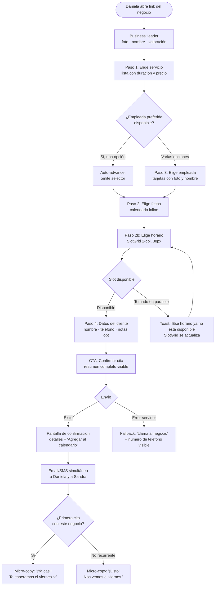
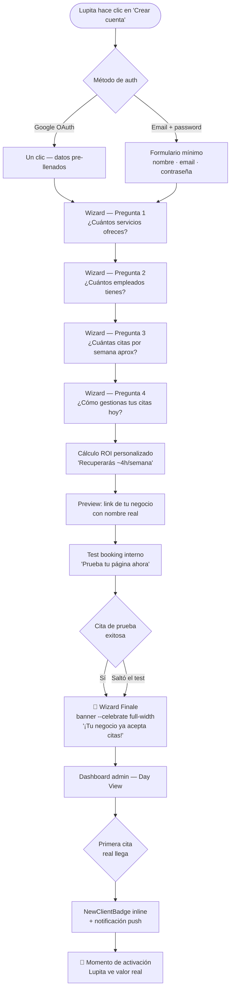
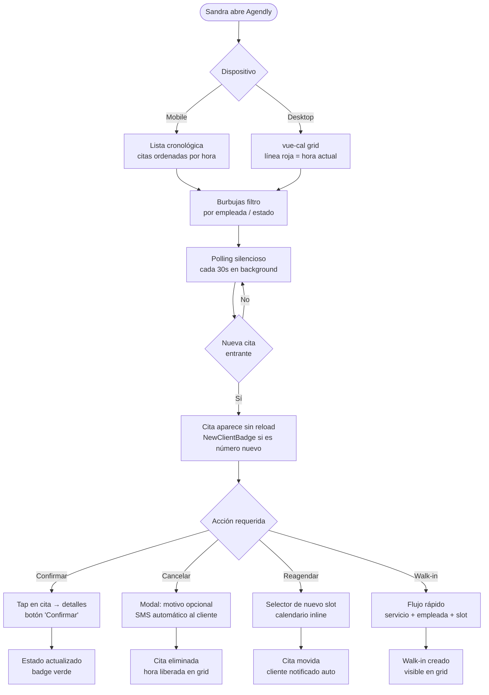
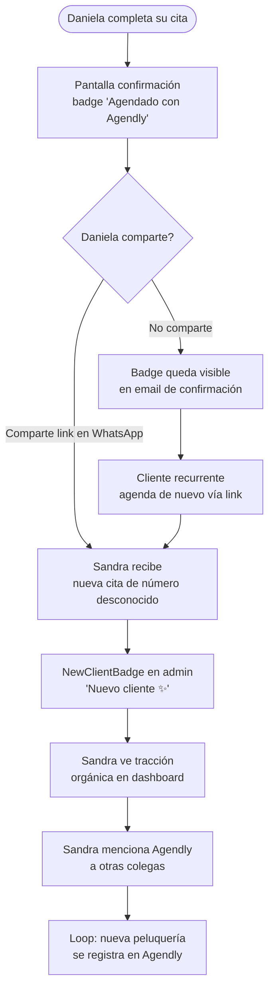

# UX Design Specification Agendly

**Author:** Nico
**Date:** 2026-03-02

---

<!-- UX design content will be appended sequentially through collaborative workflow steps -->

## Executive Summary

### Project Vision

Agendly es una plataforma SaaS de agendamiento de citas para negocios pequeños de belleza y estética en México. Resuelve un techo de tiempo operativo: los dueños invierten horas diarias coordinando citas por WhatsApp sin capacidad residual para enfocarse en la calidad del servicio. La propuesta central no es el canal — es la certeza: el cliente sabe que su cita es real, el dueño sabe que su día está definido sin haber monitoreado ningún chat.

**Estados objetivo como criterios de diseño:**
- Dueño del negocio: *"Estoy en control sin estar pendiente"*
- Cliente final: *"Fue tan fácil que lo haré de nuevo"*

### Target Users

| Persona | Contexto de uso | Nivel tech | Dispositivo principal |
|---|---|---|---|
| **Lupita** — dueña de salón, low-tech | Siempre en movimiento, opera todo desde el celular | Básico | Celular |
| **Roberto** — dueño de barbería, tech-savvy | Quiere control y estadísticas, gestiona empleados | Medio-alto | Celular + desktop |
| **Don Marco** — dueño de spa, delega | Opera a través de recepcionista, prioriza confiabilidad | Mínimo | Celular (indirecto) |
| **Daniela** — cliente final, digital nativa | Agenda desde link de WhatsApp, contexto de alta distracción | Alto | Celular |

**Insight crítico:** El dueño administra su negocio desde el celular. Cualquier flujo de admin que requiera desktop está mal diseñado para este producto.

### Key Design Challenges

1. **Onboarding no técnico para dueños** — El wizard debe llevar a alguien como Lupita desde registro hasta primera cita recibida en ≤ 15 minutos, sin jerga técnica, con cálculo de ROI visible ("¿cuántas citas pierdes por semana?")

2. **Formulario público — fricción cero en contexto móvil** — El cliente final agenda sin crear cuenta, con solo nombre + teléfono. El flujo completo en ≤ 3 pasos, desde un celular, en condición de alta distracción (abrió el link mientras esperaba el camión, con el pulgar, bajo el sol). Contexto crítico: tasas de abandono superan el 50–60% cuando se solicita creación de cuenta antes de mostrar disponibilidad.

3. **Admin móvil — vista de día calmante** — La agenda es una pantalla de consulta, no una herramienta de trabajo activa. El dueño la abre una vez en la mañana y necesita saber todo de un vistazo sin interacción adicional.

### Design Opportunities

1. **"Sin cuenta" como ventaja comunicada, no solo implementada** — "Agenda en segundos. Sin crear cuenta." debe ser visible antes de que el usuario encuentre cualquier fricción, no después. Convierte una decisión técnica en un mensaje de conversión en el momento de mayor intención.

2. **Onboarding como momento de activación celebratorio** — El wizard culmina con "Tu negocio está listo — comparte este link". La primera cita llegando sola puede diseñarse como un evento notable en el admin (el momento "¡ya llegó una cita sola!" de Lupita).

3. **Growth loop badge como touchpoint de adquisición** — El badge "Agenda gestionada por Agendly →" en formulario y emails es un punto de exposición B2B embebido en la experiencia B2C. Debe ser sutil pero clicable.

4. **Fallback como confianza, no como error** — Ante cualquier fallo del sistema, mostrar el contacto directo del negocio refuerza confianza en vez de comunicar fracaso.

## Design Principles

Los siguientes principios guían todas las decisiones de diseño de Agendly:

1. **Valor antes del compromiso** — El usuario siempre ve disponibilidad real antes de que se le pida cualquier dato. Elegir servicio → elegir slot → ingresar datos.

2. **Diseño para contexto móvil de alta distracción** — Cada interacción funciona con pulgar, bajo sol, en 30 segundos de atención disponible. Test de referencia: ¿puede completarse con una sola mano sin leer instrucciones?

3. **Sin cuenta = ventaja comunicada, no solo implementada** — El mensaje "agenda sin crear cuenta" aparece visible al inicio del flujo de reserva, antes de cualquier campo de formulario.

4. **Cero ambigüedad sobre el estado del sistema** — Si el usuario completó el flujo, sabe con absoluta certeza que su cita existe. Confirmación en pantalla + email son el contrato de confiabilidad del producto.

5. **Fácil para quien agenda. Automático para quien recibe.** — Dos audiencias, dos experiencias, un solo sistema. Para el cliente: el flujo más corto de intención a confirmación. Para el dueño: una agenda que opera sin que él haga nada.

## Core User Experience

### Defining Experience

La acción central de Agendly tiene dos caras del mismo producto:

**Para el cliente (Daniela):** Abrir un link → ver disponibilidad real → confirmar una cita. Todo en ≤ 3 pasos, sin crear cuenta, desde el celular, en 30 segundos de atención disponible. La cita confirmada es el evento que define el éxito — no el proceso.

**Para el dueño (Lupita/Roberto):** Abrir el admin en la mañana y saber todo lo que pasa en el día de un vistazo. Sin tocar nada, sin buscar información, sin responder mensajes. La agenda funciona — eso es la promesa.

El loop central del producto: **cliente agenda → dueño recibe**. Si este loop funciona sin fricción visible en ninguna de las dos puntas, Agendly cumple su propuesta de valor.

**Acción crítica a perfeccionar primero:** La transición de "link recibido" a "cita confirmada" en el formulario público. Es el momento de mayor intención y mayor riesgo de abandono.

### Platform Strategy

**Formulario público (experiencia del cliente):**
- Web móvil — funciona desde cualquier link compartido, sin instalación de app
- Touch-first: targets grandes, scroll vertical natural, teclado solo para captura de datos
- Sin requerimiento de cuenta — sin descargas, sin contraseñas
- Compatible con cualquier dispositivo (el dueño comparte el link por WhatsApp)

**Admin — vista adaptativa por dispositivo (mismo URL, responsive puro):**

| Dispositivo | Vista principal | Lógica |
|---|---|---|
| **Mobile** | Lista cronológica + filtro de empleados (burbujas con avatar) | Consulta rápida de mañana — certeza en 5 segundos |
| **Desktop / Tablet** | Cuadrícula tipo calendario (columnas por empleado × filas de tiempo) | Herramienta de maximización: detectar huecos, visualizar capacidad disponible |

El dispositivo define el layout automáticamente — el dueño no configura ni elige versión.

**Detalle de orientación en desktop:** Línea horizontal roja mostrando la hora actual cruzando todas las columnas — orientación instantánea sin buscar un reloj.

**Avatar de empleada:** Iniciales + color generado determinísticamente desde el nombre (paleta curada de 8-10 colores accesibles, contraste garantizado). El mismo nombre siempre produce el mismo color. Sin gestión de assets, sin fotos requeridas.

**Actualización en tiempo real:** Polling automático cada 10-15s cuando la pestaña está visible (`document.visibilityState === 'visible'`). Sin refresh manual.

### Effortless Interactions

**Para el cliente:**

1. **"Cualquier empleada disponible"** — El cliente sin preferencia no enfrenta parálisis de decisión. Un tap y el sistema asigna automáticamente la primera disponible (MVP). Elimina un paso que los competidores hacen obligatorio.

2. **Disponibilidad antes que datos** — Servicio → horario → nombre + teléfono. Nunca se pide información antes de mostrar si hay disponibilidad.

3. **Confirmación inmediata e inequívoca** — La pantalla final no deja ninguna duda: servicio, empleada, fecha, hora. Sin "te contactaremos", sin "pendiente de confirmación".

**Para el dueño:**

1. **Admin carga con hoy automáticamente** — Sin navegar fechas ni filtros. Abre en la vista del día actual.

2. **Filtro por empleada en un toque (mobile)** — Burbujas de avatar arriba de la lista. Un toque filtra; otro toque regresa al total.

3. **Transparencia en asignación automática** — Las citas asignadas por el sistema muestran un chip discreto: "Asignada automáticamente · Carmen". El dueño entiende el estado sin buscar explicaciones.

4. **Onboarding sin jerga técnica** — El wizard habla en lenguaje de negocio: "¿Qué servicios ofreces? ¿Cuánto dura cada uno? ¿A qué hora abres?"

### Critical Success Moments

**Momento 1 — "Ya llegó una cita sola"** *(Lupita, primera semana)*
El dueño recibe su primera notificación sin haber hecho nada. Es el momento de retención más poderoso del producto. Debe sentirse especial — no como una notificación genérica. Si no ocurre en los primeros días de onboarding, el usuario abandona.

**Momento 2 — Confirmación del cliente** *(Daniela, cada reserva)*
La pantalla de confirmación es el contrato de confiabilidad. El cliente siente que su cita *existe* con la misma certeza que un ticket de avión comprado — en pantalla + email simultáneos.

**Momento 3 — "Tu negocio está listo"** *(Lupita/Roberto, fin del wizard)*
El wizard termina con estado celebratorio: el link del negocio está listo para compartir. El dueño tiene una tarea clara y satisfactoria: copiar el link y mandarlo por WhatsApp. Activación diseñada como logro.

**Momento 4 — La mañana tranquila** *(todos los dueños, diariamente)*
Abrir el admin a las 9am y saber exactamente qué pasa en el día. Vista calmante: citas ordenadas, sin mensajes sin responder, sin incertidumbre. Este momento repetido construye el hábito y el valor percibido.

**Momento 5 — Reserva sin fricción en contexto real** *(Daniela, primera vez)*
Completar una reserva desde el celular, en espera del camión, con el pulgar, sin haber leído ninguna instrucción. Si este momento funciona, la recomendación boca a boca está garantizada.

### Experience Principles

Los 5 principios que guían todas las decisiones de experiencia de Agendly:

1. **Valor antes del compromiso** — El usuario siempre ve disponibilidad real antes de que se le pida cualquier dato. Flujo: servicio → slot → datos.

2. **Diseño para contexto móvil de alta distracción** — Cada interacción pasa el test del pulgar + sol: ¿puede completarse con una mano sin leer instrucciones?

3. **Sin cuenta = ventaja comunicada, no solo implementada** — El mensaje "Agenda sin crear cuenta" es visible al inicio del flujo, antes de cualquier campo de formulario.

4. **Cero ambigüedad sobre el estado del sistema** — Si el flujo se completó, el usuario lo sabe con certeza absoluta. Confirmación en pantalla + email = contrato de confiabilidad.

5. **Fácil para quien agenda. Automático para quien recibe.** — El cliente tiene el flujo más corto de intención a confirmación. El dueño tiene una agenda que opera sin que él intervenga.

## Desired Emotional Response

### Primary Emotional Goals

**Para el dueño (Lupita / Roberto / Don Marco):**

| Emoción | Definición en contexto de Agendly |
|---|---|
| **Confianza** (primaria) | "Sé que mi negocio está funcionando aunque no esté mirando" — certeza de que las citas llegan, se confirman y el día está definido sin intervención activa |
| **Orgullo** (secundaria) | Doble capa: *externo* — "mi formulario se ve profesional, mis clientes me toman en serio"; *interno* — "yo logré configurar esto, yo hice que mi negocio operara solo" |
| **Calma** (soporte) | La ausencia activa de ansiedad: sin mensajes sin responder, sin incertidumbre sobre qué pasa hoy |

**Para el cliente (Daniela):**

| Emoción | Secuencia | Definición |
|---|---|---|
| **Sorpresa positiva** | Primera reserva únicamente | "¿En serio fue tan fácil? No me esperaba esto" — violación de expectativas hacia arriba en el punto donde el usuario anticipaba fricción |
| **Confianza** | Todas las reservas, incluyendo la primera | "Mi cita es real, la tienen registrada, todo está bien" — certeza inequívoca de que el sistema recibió y procesó correctamente |

**Nota de diseño crítica:** Para Daniela, sorpresa y confianza son **secuenciales, no simultáneas**. La sorpresa ocurre una sola vez (primera reserva). La confianza sostiene el uso recurrente — cuando regresa, no busca sorpresa: busca fluidez invisible.

### Emotional Journey Mapping

**Daniela — cliente final:**

```
Abre el link            → Curiosidad neutral: "vamos a ver qué tan complicado es"
Ve "sin crear cuenta"   → Sorpresa positiva: "¡espera, no necesito cuenta!"
Durante el formulario   → Fluidez / flow: "esto es más fácil de lo que esperaba"
Pantalla confirmación   → Confianza + Alivio: "ya quedó, sé que es real"
Micro-copy post-conf.   → Sorpresa reforzada: "Listo. No necesitabas crear cuenta para esto."
Recibe email            → Confianza reforzada: "lo tengo guardado, no lo voy a olvidar"
Segunda reserva         → Herramienta invisible: sin sorpresa, pura fluidez confiable
```

**Lupita / Roberto — dueño del negocio:**

```
Onboarding              → Escepticismo: "¿esto realmente va a funcionar?"
Fin del wizard          → Orgullo personal: "Lo lograste. Tu salón ya tiene agenda profesional."
Primera cita recibida   → Deleite: "¡ya llegó sola! funciona"
Badge cliente nuevo     → Orgullo de crecimiento: "un cliente nuevo llegó solo por mi link"
Check matutino diario   → Calma + Confianza: "sé exactamente qué pasa hoy"
Resumen semanal         → Orgullo cuantificado: "14 citas. ~3 horas recuperadas sin WhatsApp"
Semanas después         → Orgullo consolidado: "mi negocio opera solo, soy profesional"
Ante un error           → Confianza mantenida: el cliente ve el contacto del negocio, no un error
```

### Micro-Emotions

**Para el cliente:**
- **Sorpresa positiva > Expectativa cumplida** — la primera vez debe romper la expectativa hacia arriba, no simplemente cumplirla
- **Confianza > Escepticismo** — en cada paso el usuario siente que la cita va a existir
- **Fluidez > Confusión** — cero hesitación en ningún paso del formulario
- **Certeza > Incertidumbre** — la confirmación elimina toda duda sin espacio para "¿quedó o no quedó?"

**Para el dueño:**
- **Calma > Ansiedad** — la vista de día nunca estresa, solo tranquiliza
- **Orgullo personal > Orgullo del producto** — el wizard celebra a Lupita como persona, no al negocio como objeto
- **Orgullo externo > Vergüenza** — el formulario público se ve suficientemente bien para que el dueño lo comparta sin dudar
- **Deleite en hitos > Indiferencia** — la primera cita, el primer cliente nuevo, el primer resumen semanal deben sentirse especiales
- **Confianza > Desconfianza** — el sistema nunca deja al dueño preguntándose "¿se guardó bien?"

**Emociones a evitar en todo momento:**
- Incertidumbre ("¿se guardó mi cita?")
- Agobio (demasiadas pantallas, demasiadas opciones)
- Desconfianza ("¿este formulario es legítimo?")
- Frustración ("¿por qué me pide esto ahora?")
- Ansiedad ("¿qué pasa si algo sale mal?")
- Vergüenza ante los clientes (nunca un error visible sin fallback elegante)

### Design Implications

1. **Sorpresa positiva → Micro-copy post-confirmación que nombra lo que pasó**
Después de la confirmación exitosa, una línea discreta: *"Listo. No necesitabas crear cuenta para esto."* Nombrar explícitamente lo que el usuario acaba de evitar amplifica la sorpresa. Solo aparece en la primera reserva; en reservas recurrentes desaparece.

2. **Confianza del cliente → Confirmación con detalles específicos, no promesas genéricas**
No "tu reserva fue enviada". Sí "Tu cita está confirmada: [Servicio] con [Empleada] el [Fecha] a las [Hora]." Los detalles concretos son la evidencia de confiabilidad. Email enviado inmediatamente, no con delay.

3. **Orgullo personal de Lupita → El wizard la celebra a ella, no al negocio**
El estado final del wizard dice *"Lo lograste. Tu salón ya tiene agenda profesional."* Le da crédito a ella como agente del cambio — crítico para usuarios que no se identifican como "tech" y que han fallado con otras apps antes.

4. **Orgullo cuantificado → Resumen semanal con tiempo recuperado**
Una vez por semana, el admin muestra un mensaje: *"Esta semana recibiste 14 citas sin responder un solo WhatsApp. Eso es ~3 horas de tu tiempo."* Convierte el uso del producto en orgullo concreto y medible.

5. **Orgullo de crecimiento → Badge "cliente nuevo llegó solo"**
Cuando alguien que nunca ha agendado antes completa su primera reserva, el admin lo marca de manera distinta: *"Cliente nuevo · llegó por tu link"*. El dueño siente que su negocio crece sin esfuerzo activo.

6. **Orgullo externo → Formulario público personalizable como tarjeta digital**
El formulario incluye nombre del negocio, foto opcional y descripción breve. Un dueño que personaliza su página la comparte más — y cada vez que la comparte, refuerza su orgullo externo.

7. **Calma diaria → Silencio visual, no animaciones de tranquilidad**
La serenidad de la vista de día viene de lo que no hay: sin alertas innecesarias, sin colores de alerta en el estado normal, sin elementos compitiendo por atención.

### Emotional Design Principles

1. **La sorpresa se diseña para la primera vez; la confianza se diseña para siempre** — La primera interacción tiene un modo de diseño distinto al modo recurrente. No confundir los dos.

2. **El orgullo es la emoción de diferenciación competitiva** — Todos los competidores producen "eficiencia". Agendly produce orgullo. Esa es la brecha que no se copia fácilmente porque requiere entender emocionalmente al usuario, no solo funcionalmente.

3. **Celebrar a la persona, no al producto** — El wizard y los hitos celebran a Lupita como agente de cambio. "Lo lograste" supera a "está listo" porque el crédito va a quien importa.

4. **Los momentos de deleite son hitos, no decoración** — Primera cita, cliente nuevo, resumen semanal: tres momentos diseñados con intención. No animar cada tap — solo los hitos que construyen la narrativa de valor.

5. **La confianza se construye con evidencia específica, no con promesas genéricas** — Detalles concretos en la confirmación, tiempo recuperado en el resumen, nombre del empleado en la cita. Los números y nombres específicos son el lenguaje de la confianza.

## UX Pattern Analysis & Inspiration

### Inspiring Products Analysis

#### Referencia del Dueño

**WhatsApp**
- Problema central que resuelve: comunicación instantánea sin fricción de instalación previa ni configuración técnica
- Por qué funciona: interfaz conocida (chat), sin learning curve, activa en México en 97% de smartphones con datos
- Patrón clave: el estado de lectura (✓✓ azul) elimina la incertidumbre de "¿llegó mi mensaje?" — equivalente directo a la confirmación de cita de Agendly
- Lección transferible: el usuario ya opera en este entorno; cualquier cosa más complicada que WhatsApp es fricción inaceptable para Lupita

**Google Calendar**
- Problema central que resuelve: visibilidad de lo que pasa en el tiempo, coordinación entre personas
- Por qué funciona: vista de día/semana como modelo mental compartido universalmente, color-coding por categoría, actualización en tiempo real
- Patrón clave: la vista de día como panel de control calmante — información completa sin necesidad de interacción
- Lección transferible: el admin de Agendly hereda la metáfora del calendario (grilla de tiempo en desktop), pero optimizada para consulta en 5 segundos, no para gestión activa

**Airbnb**
- Problema central que resuelve: confianza en una transacción con un desconocido — a través de diseño, no solo reputación
- Por qué funciona: muestra disponibilidad real antes de pedir datos personales; el calendario de disponibilidad es la primera pantalla; el precio total aparece antes del checkout
- Patrón clave: "Valor antes del compromiso" — ves la foto, el precio y la disponibilidad antes de crear cuenta o ingresar tu tarjeta
- Lección transferible: el formulario público de Agendly muestra slots reales antes de pedir nombre y teléfono — la misma secuencia psicológica que convierte visitantes en reservas

#### Referencia del Cliente (Daniela)

**Uber**
- Problema central que resuelve: transporte confiable en contexto de alta ansiedad (¿llegará? ¿dónde está?)
- Por qué funciona: el mapa en tiempo real transforma la incertidumbre en control visual; la confirmación es inmediata y específica (nombre del conductor, placa, tiempo estimado)
- Patrón clave: confirmación como artefacto concreto — no "tu solicitud fue enviada" sino "Ricardo · Honda Civic · gris · 3 min"
- Lección transferible: la pantalla de confirmación de Agendly debe nombrar todo con la misma especificidad: servicio, empleada, fecha, hora — no "tu cita fue registrada"

**Rappi**
- Problema central que resuelve: delivery en contexto móvil de alta distracción, con muchas opciones y poco tiempo de decisión
- Por qué funciona: filtros visuales grandes y tactiles; la foto del producto vende antes que la descripción; el tiempo de entrega visible antes del compromiso
- Patrón clave: reducción de parálisis de decisión mediante agrupación visual y opción de "más popular"
- Lección transferible: el slot grid de Agendly usa el mismo principio — opciones visuales grandes y tactiles, no listas de texto con horarios

**Cinépolis**
- Problema central que resuelve: selección de asiento en flujo de compra de tickets
- Por qué funciona: la visualización del mapa de butacas convierte una decisión abstracta en una decisión espacial e intuitiva; disponible/ocupado en color
- Patrón clave: disponibilidad visual > lista textual — el usuario ve inmediatamente dónde puede sentarse sin leer nada
- Lección transferible: la grilla de slots de Agendly (disponible/ocupado en color) hereda este patrón — el ojo escanea antes de que el cerebro decida

**Amazon / Mercado Libre / Shein**
- Problema central que resuelven: decisión de compra en contexto de incertidumbre (¿llegará? ¿es lo que parece?)
- Por qué funciona: urgency real ("quedan 3 en stock"), confirmación de pedido con número de orden específico, email de confirmación inmediato
- Patrón clave: el número de orden / confirmación como "ticket" — el usuario tiene prueba tangible de que la transacción existe
- Lección de urgency (Amazon): mostrar stock real cuando es bajo ("Quedan 2 disponibles") convierte la escasez en decisión, no en presión manipuladora — funciona porque es verdad
- Lección transferible: urgency de slots en Agendly (≤2 disponibles hoy) sigue el mismo principio de escasez real, no fabricada

---

### Competitive Anti-Patterns (Fresha / Booksy)

Investigación directa de los competidores líderes en el espacio. Estas son las razones por las que dueños de salones los abandonan:

**Anti-pattern 1: "Impuesto al Crecimiento"**
- Qué hace: cobran comisión sobre citas de clientes que el dueño ya tenía antes de usar la plataforma
- Por qué falla: el dueño siente que el crecimiento de su negocio está siendo gravado por una app que él usa para administrar, no para adquirir clientes
- Principio de Agendly opuesto: Agendly cobra subscripción plana, no comisión. El éxito del negocio no aumenta el costo de la herramienta.

**Anti-pattern 2: "Branding Caníbal"**
- Qué hace: las notificaciones y emails de confirmación dicen "Reserva en Fresha" antes que el nombre del negocio; el cliente recuerda Fresha, no el salón
- Por qué falla: el dueño pierde identidad de marca en el canal más crítico de comunicación con su cliente
- Principio de Agendly opuesto: "Tu cita en [Nombre del Salón]" — Agendly aparece solo en el badge discreto al pie, nunca antes que la identidad del negocio

**Anti-pattern 3: "Parálisis por Análisis"**
- Qué hace: onboarding con 40+ configuraciones antes de poder recibir la primera cita; dashboard con 12 widgets y analytics que Lupita nunca va a usar
- Por qué falla: el costo cognitivo del setup supera el valor percibido; el usuario abandona antes de llegar al "momento aha"
- Principio de Agendly opuesto: el wizard responde solo 4 preguntas de negocio (servicios, duración, horario, empleadas) — primera cita recibible en ≤15 minutos

**Anti-pattern 4: "Muro de Pago Opaco"**
- Qué hace: tier gratuito suficientemente funcional para enganchar, luego cambios de política que mueven features clave a planes de pago sin aviso claro
- Por qué falla: destruye confianza en el momento más crítico — cuando el negocio ya depende de la plataforma
- Principio de Agendly opuesto: pricing transparente desde el primer día; el dueño sabe exactamente qué incluye su plan antes de configurar nada

**Anti-pattern 5: "Sincronización Glitchy"**
- Qué hace: doble booking ocasional cuando dos clientes seleccionan el mismo slot simultáneamente; discrepancias entre la app del dueño y el formulario público
- Por qué falla: una sola cita duplicada destruye meses de confianza construida — el dueño vuelve a WhatsApp porque "al menos ahí sé que es manual y tengo control"
- Principio de Agendly opuesto: reserva atómica con lock optimista en backend; el slot desaparece del formulario público en el momento en que se confirma, no después

---

### Transferable UX Patterns

#### Patrones de Navegación

**Slot-first, empleada-second** *(de Cinépolis + confirmación de Nico)*
- Flujo: Servicio → Slot de tiempo → Empleada disponible en ese slot
- No al revés: si el usuario elige empleada primero, luego descubre que Carmen no tiene horas que le funcionen y tiene que backtrack
- El slot es el filtro real de disponibilidad; la empleada es consecuencia de la disponibilidad del slot
- Aplicación en Agendly: el paso 2 del formulario público muestra la grilla de tiempo; el paso 3 asigna empleada (o "cualquier disponible" por defecto)

**Progresión lineal sin backtracking** *(de Uber + Rappi)*
- El usuario nunca necesita volver atrás porque el flujo está ordenado para eliminar decisiones que bloqueen las siguientes
- Aplicación en Agendly: servicio → slot → datos mínimos → confirmación — en ese orden exacto, sin ramificaciones

**Admin como panel de consulta, no de trabajo** *(de Google Calendar)*
- La vista de día no requiere interacción para ser útil — la información está ahí, organizada, lista para consumir
- Aplicación en Agendly: el admin abre en hoy, carga citas sin acción del dueño, muestra todo sin que el dueño tenga que filtrar ni buscar

#### Patrones de Interacción

**Confirmación como artefacto concreto** *(de Uber + Amazon)*
- La confirmación nombra todo con especificidad: quién, qué, cuándo, dónde
- No "tu solicitud fue procesada" — sí "Tu cita con Carmen · Corte y color · Martes 4 de marzo · 3:00 PM"
- Email inmediato como respaldo tangible (Daniela lo reenvía a su calendario o lo muestra el día de la cita)

**Urgency de disponibilidad real** *(de Amazon + Shein, confirmado por Nico)*
- Cuando quedan ≤2 slots disponibles en el día seleccionado: "Quedan 2 horarios disponibles hoy"
- Cuando queda solo 1: "Último horario disponible hoy"
- NUNCA contadores sociales falsos ("3 personas están viendo esto") — solo escasez real de disponibilidad
- Aplicación: aparece debajo de la grilla de slots, solo cuando aplica

**"Cualquier disponible" como primera opción** *(de Airbnb — "¿Cuándo?" antes que "¿Dónde exactamente?")*
- El cliente sin preferencia de empleada no enfrenta parálisis de decisión
- Un tap y el sistema asigna la primera disponible en el slot seleccionado
- Aplicación: en el paso de empleada, la primera opción siempre es "Cualquier empleada disponible" — preseleccionada por default

#### Patrones Visuales

**Disponibilidad como estado visual, no textual** *(de Cinépolis + Airbnb)*
- El usuario escanea con los ojos antes de decidir con el cerebro
- Slots disponibles en color primario, ocupados en gris — sin necesidad de leer etiquetas
- Aplicación: la grilla de slots usa color como primer comunicador de disponibilidad

**Identidad visual del negocio, no de la plataforma** *(lección inversa de Booksy)*
- El nombre del negocio es el titular de cada comunicación; Agendly es el footnote
- El formulario público muestra: nombre del negocio, foto opcional, descripción — antes de cualquier elemento de Agendly
- Aplicación: el badge "Agenda con Agendly →" aparece al pie del formulario, nunca al inicio

**Silencio visual como diseño** *(de WhatsApp + Google Calendar)*
- La ausencia de elementos innecesarios es una decisión de diseño, no omisión
- El admin de Agendly en mobile: lista de citas, filtro por empleada — nada más
- Sin widgets de analytics, sin notificaciones de "tips", sin banners de upgrade en la vista principal

---

### Anti-Patterns to Avoid

1. **Solicitar datos antes de mostrar disponibilidad** — El formulario nunca pide nombre, teléfono o email antes de mostrar la grilla de slots reales. La tasa de abandono supera el 50–60% cuando el primer paso es un campo de texto.

2. **Flujo empleada → slot** — Elegir empleada primero obliga al usuario a backtrack cuando descubre que su preferida no tiene horarios disponibles. El slot es el filtro correcto; la empleada es consecuencia.

3. **Confirmación genérica o diferida** — "Tu reserva fue enviada, te contactaremos" destruye la confianza que el formulario construyó. La confirmación es inmediata, específica y genera email simultáneo.

4. **Contadores sociales falsos** — "X personas viendo este horario" es percibido como manipulación, especialmente por usuarios de alta distraccción que ya están en estado de evaluación crítica.

5. **Branding de plataforma sobre identidad del negocio** — El cliente de Lupita debe sentir que está agendando con Lupita, no con Agendly. El branding de Agendly es siempre subordinado al del negocio.

6. **Dashboard con 12 widgets en la pantalla principal** — El dueño que abre el admin a las 9am necesita saber qué citas tiene hoy en 5 segundos. Cualquier elemento que no responda esa pregunta es ruido.

7. **Onboarding con más de 4–5 decisiones antes de la primera cita** — Cada paso adicional en el wizard es una oportunidad de abandono. El dueño debe poder recibir su primera cita en ≤15 minutos.

8. **Admin más complejo que WhatsApp + Google Sheets** — El benchmark de simplicidad no es Calendly ni Square: es la combinación que el dueño ya usa hoy. Si el admin de Agendly requiere más de 5 segundos para responder "¿qué citas tengo mañana?", Agendly pierde contra lo que reemplaza.

---

### Design Inspiration Strategy

#### Qué Adoptar (directamente)

- **Slot-first flow** — El orden servicio → slot → empleada es el único que elimina backtracking. No hay razón para modificarlo.
- **Datos mínimos en formulario** — Nombre + teléfono únicamente (como Rappi en su primer pedido). El email es opcional, requerido solo para confirmación.
- **Grid visual de slots** — Disponible/ocupado en color, no lista textual. Herencia directa de Cinépolis + Airbnb.
- **Confirmación como artefacto real** — Pantalla + email inmediato, con todos los detalles específicos. De Uber.
- **Polling silencioso** — Actualización automática sin refresh manual cuando la pestaña está visible. De WhatsApp.
- **Identity-first en el formulario público** — El nombre del negocio y la foto van primero. De la lección inversa de Booksy.
- **"Cualquier disponible" como primera opción** — Preseleccionada, un tap, sin fricción. Elimina parálisis de decisión.

#### Qué Adaptar (modificar para contexto de Agendly)

- **Urgency de Airbnb/Amazon** → Adaptar a disponibilidad de slots (no de inventario). Solo cuando ≤2 slots quedan disponibles en el día seleccionado. "Quedan 2 horarios disponibles hoy" — escasez real, no fabricada.
- **Línea de hora actual de Google Calendar** → Adaptar a vista desktop/tablet del admin. Línea roja horizontal cruzando todas las columnas de empleadas — orientación sin reloj.
- **Wizard de apps de onboarding** → Adaptar con el principio: **"El wizard no enseña features — resuelve preguntas. Cada paso responde una sola pregunta de negocio."** 4 preguntas: servicios → duración → horario → empleadas. Sin jerga técnica.

#### Qué Evitar (anti-patterns identificados)

- **Comisiones por cita** de Fresha/Booksy — pricing plano, nunca variable por volumen de negocio del dueño
- **Branding caníbal** en notificaciones — el nombre del negocio siempre primero
- **Feature bloat en onboarding** — el dueño no necesita aprender la herramienta, necesita recibir su primera cita
- **Políticas de pricing cambiantes** — transparencia total desde el día 1
- **Doble booking por falta de atomicidad** — reserva atómica en backend, slot bloqueado al iniciar checkout

#### Tabla de Priorización MVP / V1 / V2

| Patrón | Prioridad | Razón |
|---|---|---|
| Slot-first flow (servicio → slot → empleada) | **MVP crítico** | Elimina el error de flujo más común; sin esto el producto no funciona |
| Datos mínimos (nombre + teléfono) | **MVP crítico** | El gate de abandono más alto; sin esto no hay conversión |
| Grid visual de slots (color disponible/ocupado) | **MVP crítico** | Reemplaza lista textual; esencial para contexto móvil de alta distracción |
| Confirmación como artefacto real (pantalla + email) | **MVP crítico** | Sin esto la promesa de certeza no existe |
| Polling silencioso (10–15s, tab visible) | **MVP crítico** | Sin esto el admin puede mostrar slots ya tomados |
| Identity-first en formulario público | **MVP crítico** | Diferenciador contra Booksy desde el día 1 |
| "Cualquier disponible" como primera opción | **MVP crítico** | Elimina el paso más probable de abandono en selección de empleada |
| Urgency de disponibilidad real (≤2 slots) | **V1** | Mejora conversión; requiere lógica de conteo en tiempo real |
| Línea de hora actual en desktop (admin) | **V1** | Mejora orientación en admin desktop; no crítico para MVP móvil |
| Badge "cliente nuevo · llegó por tu link" | **V2** | Momento de orgullo de crecimiento; requiere tracking de first-time clients |
| Resumen semanal con tiempo recuperado | **V2** | Momento de orgullo cuantificado; requiere datos históricos acumulados |
| Micro-copy post-confirmación primera vez | **V2** | Amplifica sorpresa positiva; requiere lógica de "primera reserva de este usuario" |

## Design System Foundation

### Design System Choice

**Sistema Themeado:** Nuxt 3 + Nuxt UI v2 + Tailwind CSS

- **Nuxt 3** — SSR para formulario público, file-based routing, server routes como mini-BFF para MVP, auto-imports
- **Nuxt UI v2** — librería oficial del equipo de Nuxt, SSR-ready, Tailwind-based, sin problemas de hydration
- **vue-cal** — solo para la vista desktop del admin (columnas por empleada × filas de tiempo, desde breakpoint `lg:`)
- **Lucide Icons** — incluido en Nuxt UI

### Rationale for Selection

1. **Nuxt sobre Vue standalone para solo dev** — file-based routing, server routes como BFF, auto-imports: menos configuración, más velocidad de desarrollo
2. **SSR crítico para el formulario público** — Daniela en 3G/4G en México necesita first contentful paint prerenderizado; un CRA/SPA introduce latencia perceptible en el momento de mayor riesgo de abandono
3. **Nuxt UI sobre shadcn-vue** — mismo equipo que Nuxt, SSR-ready nativo, sin problemas de hydration; shadcn-vue tiene limitaciones conocidas en SSR
4. **Diferenciación desde el día 1** — CSS variables en `app.config.ts` propagan la paleta de marca en todos los componentes sin override manual

### Color Palette — Agendly Brand

Dos temperaturas emocionales que mapean directamente al journey emocional del Step 4:

| Token | Hex | Uso | Temperatura emocional |
|---|---|---|---|
| `--brand-500` | `#2383E2` | CTA principal, slots disponibles, iconos, links | Confianza / Calma |
| `--brand-600` | `#1A6BC4` | Hover de botón primario | Confianza |
| `--brand-700` | `#1256A0` | Texto de marca sobre fondo blanco | Confianza (accesible) |
| `--brand-50` | `#EFF6FF` | Backgrounds chips seleccionados | Confianza |
| `--brand-100` | `#DBEAFE` | Badges, urgency backgrounds | Confianza |
| `--celebrate` | `#FBBF24` | **Background-only** — wizard finale, primera cita, resumen semanal | Orgullo / Deleite |
| `--success` | `#10B981` | Pantalla de confirmación | Certeza |
| `--warning` | `#F59E0B` | Urgency slots ≤2 disponibles | Atención |
| `--error` | `#EF4444` | Error states — siempre con fallback visible | — |
| `--neutral-50` | `#F9FAFB` | Admin page background | Silencio visual |
| `--neutral-900` | `#111827` | Texto principal | — |

**Narrativa del color:** El `--brand-500` comunica confianza y profesionalismo sin sentirse frío o corporativo. El `--celebrate` aparece únicamente en momentos de orgullo y deleite — esa rareza es lo que los hace sentir especiales.

**Reglas de accesibilidad (WCAG):**
- `--brand-500` (#2383E2): ~3.9:1 sobre blanco → válido para elementos de UI (botones, iconos). No usar como texto de cuerpo sobre blanco.
- `--brand-700` (#1256A0): ≥4.5:1 → usar cuando el azul de marca necesita ser texto sobre blanco.
- `--celebrate` (#FBBF24): ~1.6:1 sobre blanco → **background-only**. El texto que va encima siempre usa `--neutral-900` (contraste 11:1).

### Motion System

Dos velocidades. No más.

| Contexto | Valor | Cuándo |
|---|---|---|
| Interacciones base | `transition: colors 150ms ease-in-out` | Hover, focus, active en cualquier elemento interactivo |
| Momentos celebratorios | scale-in + fade, 300ms ease-out | Wizard finale, primera cita recibida, resumen semanal |
| Todo lo demás | sin animación | Admin daily view, formulario, confirmación |

150ms = invisible para el cerebro, percibido como "responde bien". 300ms = perceptible, percibido como "este momento importa". No hay una tercera velocidad.

### Responsive Breakpoints

| Breakpoint | Valor | Vista del admin |
|---|---|---|
| Mobile (default) | < 1024px | Lista cronológica + filtro de empleadas |
| Desktop (`lg:`) | ≥ 1024px | Grilla vue-cal (columnas por empleada × filas de tiempo) |

El switch es automático — el dueño no configura ni elige versión.

### Touch Target Standards

**Regla de sistema:** todos los elementos interactivos tienen área táctil mínima de 44×44px. Aplica a: botones de slot, filtros de empleada (burbujas), CTA del formulario, botones de wizard, opciones de servicio.

**"Lupita Test" — Criterio de Aceptación Visual:**
> ¿Funciona este componente con el pulgar de la mano derecha, en Chrome mobile, en un Samsung A14, con Network throttling en Slow 3G, con brillo al máximo?

### Implementation Approach

```bash
npx nuxi@latest init agendly
cd agendly && npx nuxi@latest module add ui
npm install vue-cal
```

**`app.config.ts`:**
```ts
export default defineAppConfig({ ui: { primary: 'blue', gray: 'slate' } })
```

**Componentes Nuxt UI para MVP:** `UButton`, `UCard`, `UInput` / `UForm`, `USelect` / `URadioGroup`, `UBadge`, `UModal` / `USlideOver`, `UAvatar`

### Customization Strategy — Component Architecture

| Contexto | Componente | Librería | Razón |
|---|---|---|---|
| Formulario público — slot grid | Custom CSS Grid buttons | Ninguna (~50-80 líneas Vue) | Control total de touch targets; sin overhead |
| Admin mobile — lista de citas | `AppointmentListItem` custom | Nuxt UI (`UCard`, `UBadge`) | Nuxt UI estructura; custom maneja datos de cita |
| Admin mobile — filtro empleadas | `EmployeeFilterBubbles` custom | CSS Flexbox + `UAvatar` | Interacción específica: tap filtra, tap vuelve al total |
| Admin desktop — calendario | `AdminCalendarGrid` | vue-cal | Columnas por empleada × filas de tiempo (desde `lg:`) |
| Admin desktop — línea hora actual | `CurrentTimeLine` | CSS `position:absolute` | Línea roja sin JS adicional |

**Avatar de empleada:** Componente custom — iniciales + color determinístico por hash del nombre → paleta curada de 8-10 colores accesibles. El mismo nombre siempre produce el mismo color.

**Tipografía:** Inter (Google Fonts) — `text-sm` / `text-base` / `text-lg`, jerarquía `font-medium` / `font-semibold`.

## 2. Core User Experience

### 2.1 Defining Experience

**La frase:** *"Un link, un tap, una cita confirmada."*

Agendly no cambia quién agenda — los clientes de Lupita ya quieren agendar, ya lo intentan, ya la contactan. Lo que cambia es el mecanismo: elimina la negociación verbal y la transcripción manual que ocurre después.

**Sin Agendly:** Cliente manda WhatsApp → espera → Lupita revisa su libreta → Lupita responde con opciones → cliente elige → Lupita anota en libreta → cita existe en un cuaderno.

**Con Agendly:** Cliente toca el link → ve disponibilidad real → toca un slot → recibe confirmación inmediata. Lupita no hizo nada. La libreta sigue en blanco — el admin ya tiene la cita.

**La acción que hay que perfeccionar primero:** el momento en que el cliente toca el link y ve la grilla de disponibilidad. Si ese primer pantallaso genera confianza ("esto está actualizado, esto es real"), el resto del flujo cierra solo. Si genera duda ("¿esto es de hoy? ¿está actualizado?"), el cliente abandona y manda WhatsApp de todas formas.

---

### 2.2 User Mental Model

**El modelo mental actual del cliente:**

Agendar = negociar disponibilidad con una persona. El flujo esperado por Daniela:
1. Pregunto ("¿cuándo tienes libre?") — pregunta abierta, no específica
2. Espero respuesta (puede ser horas)
3. La dueña me propone opciones consultando su agenda
4. Elijo una opción
5. La dueña lo anota
6. Confío en que lo anotó bien

**La ruptura de expectativa que Agendly genera:**
El cliente espera un canal de comunicación — recibe un sistema de selección. El diseño tiene que resolver esta transición antes de que el usuario abandone: la grilla de slots es inmediatamente reconocible (Cinépolis, Airbnb) pero su presencia en el contexto de un salón de belleza local es nueva. El indicador "Agenda sin crear cuenta · disponibilidad en tiempo real" es el puente que convierte la sorpresa en confianza, no en desconfianza.

**Puntos de confusión / fricción esperados:**

| Momento | Duda del usuario | Solución de diseño |
|---|---|---|
| Primer pantallaso de la grilla | "¿Esto está actualizado? ¿Es de hoy?" | Indicador discreto en header de grilla: *"Disponibilidad actualizada · hace 8 seg"* — número concreto, no "en tiempo real" que suena a marketing. Se actualiza con cada poll. |
| Después de tocar el slot | "¿Ya quedó? ¿O todavía falta algo?" | El slot seleccionado cambia de estado visualmente (filled, no solo borde) + indicador de progreso visible |
| Pantalla de confirmación | "¿En serio ya quedó? ¿No me van a llamar para confirmar?" | La confirmación debe sentirse como un ticket, no como un formulario enviado — detalles completos, --success color, email simultáneo |
| Slot tomado en simultáneo | "¡Error! Se rompió" | Mensaje específico: "Este horario acaba de ser reservado — elige otro" + grilla actualizada, no pantalla de error |

**El modelo mental del dueño (Lupita):**

La libreta es el sistema de confianza. Cualquier nueva herramienta se evalúa contra ella: "¿es más confiable que mi libreta?" La respuesta tiene que ser sí, demostrado, no prometido. La primera semana, Lupita probablemente va a mantener ambas — libreta + Agendly. El momento en que solo Agendly es suficiente es el punto real de retención.

**Clientes sin cita:** el walk-in culture no desaparece. El admin necesita un camino para agregar citas manuales (walk-ins que llegaron en persona) sin fricción — si esto falta, el dueño mantiene la libreta en paralelo para esos casos y la coherencia del sistema se rompe.

---

### 2.3 Success Criteria

**El flujo de reserva es exitoso cuando:**

- El cliente completa la reserva en ≤ 4 pasos sin necesidad de leer instrucciones
- La confirmación en pantalla contiene todos los datos específicos: servicio, empleada, fecha, hora — sin campos vacíos ni promesas genéricas
- El email de confirmación llega antes de que el cliente cierre la pantalla de confirmación
- Si un slot fue tomado simultáneamente, el usuario ve disponibilidad actualizada — no una pantalla de error
- El cliente no manda WhatsApp después de completar el flujo para "verificar que quedó"

**El admin es exitoso cuando:**

- El dueño abre el admin en la mañana y sabe qué pasa hoy en ≤ 5 segundos sin ninguna interacción
- Los walk-ins se pueden agregar manualmente desde el admin en ≤ 3 taps
- Una cita agendada desde el formulario público aparece en el admin sin delay perceptible
- El dueño nunca tiene duda de qué es más confiable: el admin o su libreta

**El wizard es exitoso cuando:**

- Lupita completa el test booking al final del wizard y ve su propia cita aparecer en el admin
- El admin nunca muestra "cero citas" la primera mañana — la cita de prueba elimina el silencio de arranque
- El tiempo entre fin del wizard y primera cita real de un cliente es ≤ 48 horas (activación acelerada por prueba propia)

**El producto falla si:**

- El cliente abandona el formulario y manda WhatsApp de todas formas
- El dueño sigue manteniendo una libreta en paralelo después de la primera semana
- Ocurre un double-booking — uno solo destruye la confianza de Lupita en el sistema

---

### 2.4 Novel UX Patterns

**Patrones establecidos que Agendly hereda (zero educación requerida):**

| Patrón | Referencia | Por qué no necesita enseñarse |
|---|---|---|
| Grilla visual de disponibilidad | Cinépolis, Airbnb | Universal en México — el ojo ya sabe que azul = disponible, gris = ocupado |
| Form de nombre + teléfono | Cualquier formulario móvil | La interacción más familiar en mobile |
| Confirmación por email | Amazon, Uber, cualquier e-commerce | El usuario espera el email — lo busca activamente |
| Navegación paso a paso con progreso | Apps de delivery, Uber | "Paso 2 de 4" es comprensible sin instrucciones |

**El elemento genuinamente nuevo para este contexto:**

La combinación **"disponibilidad real + confirmación instantánea sin persona humana en el loop"** es nueva para el sector de belleza en México. No es que las tecnologías sean nuevas — es que este dueño y este cliente nunca han tenido acceso a ellas juntas en este contexto.

La fricción conceptual no es técnica: es de confianza. "¿Este sistema es tan confiable como Lupita diciéndome 'ya quedaste'?" El diseño responde esta pregunta con evidencia concreta, no con promesas.

**Cómo construir confianza en el patrón nuevo:**
1. Indicador de actualización con timestamp concreto ("actualizada · hace 8 seg") — sin que el usuario lo pida
2. Confirmación que nombra todo específicamente (no genérica)
3. Email inmediato como respaldo tangible
4. Fallback visible: si algo falla, el contacto directo del negocio aparece — el sistema nunca deja al usuario sin salida

---

### 2.5 Experience Mechanics

#### Iniciación

- El dueño comparte el link del negocio por WhatsApp: `agendly.com/[nombre-negocio]`
- El cliente toca el link directamente desde la conversación de WhatsApp
- La página carga SSR-prerenderizada: primera vista en < 2s incluso en Slow 3G
- Primera pantalla: nombre del negocio + foto + descripción + indicador "Agenda sin crear cuenta"

#### Interacción — Paso 1: Servicio

- Cards de servicios: nombre, duración, precio — una sola selección
- Tap en una card → estado seleccionado (filled, borde --brand-500, fondo --brand-50)
- CTA "Elegir horario" aparece al seleccionar — no antes
- Sin dropdown, sin lista de texto: solo cards táctiles ≥44×44px

#### Interacción — Paso 2: Fecha y horario

- Selector de fecha: tabs horizontales con los próximos 7 días (scroll horizontal)
- **Header de grilla:** texto discreto — `Disponibilidad actualizada · hace 8 seg` — se actualiza con cada poll silencioso. Copy concreto, no "en tiempo real"
- Grilla de slots: CSS Grid, columnas de tiempo
  - Disponible: fondo --brand-500, texto blanco
  - Ocupado: fondo --neutral-200, texto --neutral-400, `pointer-events: none`
  - Seleccionado: escala 1.05 + borde grueso + check icon
- Urgency label solo cuando aplica: "Quedan 2 horarios disponibles hoy" (--warning, encima de la grilla)
- Tap en slot disponible → selección visual inmediata → CTA "Confirmar horario"

#### Interacción — Paso 3: Empleada *(con reglas de auto-advance)*

**Regla 1 — Negocio con una sola empleada configurada:**
El paso 3 se salta completamente. La empleada se asigna automáticamente y aparece en la pantalla de confirmación, no en el flujo. El cliente nunca ve un paso con una sola opción.

**Regla 2 — Slot seleccionado con una sola empleada disponible:**
El paso 3 muestra brevemente (400ms) la empleada preseleccionada con copy: *"Solo Carmen está disponible en este horario"* → auto-advance al paso 4. No requiere acción del usuario.

**Caso estándar — múltiples empleadas disponibles:**
- Primera opción preseleccionada: **"Cualquier empleada disponible"** — avatar genérico
- Opciones adicionales: empleadas disponibles en ese slot como chips con avatar + nombre
- Tap selecciona → CTA "Continuar"

#### Interacción — Paso 4: Tus datos

- Campo: Nombre (required, `type="text"`, `autocomplete="name"`)
- Campo: Teléfono (required, `type="tel"`, `inputmode="numeric"`, `autocomplete="tel"`)
- Campo: Email (optional — "Para recibir confirmación por email")
- CTA: "Confirmar cita" — botón primario, ancho completo
- Sin contraseña, sin checkbox de términos visible en este paso, sin creación de cuenta

#### Feedback

| Estado | Qué ve el usuario | Cómo se implementa |
|---|---|---|
| Slot seleccionado | Card filled + check icon sutil | CSS transition 150ms |
| CTA tapped / enviando | Spinner en el botón, botón disabled | Estado de carga local |
| Éxito | Pantalla completa --success, check icon animado 300ms | Página reemplaza el form |
| Slot tomado en simultáneo | "Este horario acaba de ser reservado. Elige otro." + grilla actualizada | Toast + re-fetch slots |
| Error de servidor | Contacto directo del negocio visible + número de teléfono | Fallback como confianza |

#### Completado — Pantalla de confirmación

```
✓ Tu cita está confirmada   [--success background, check icon animado]

Corte y color
con Carmen
Martes 4 de marzo · 3:00 PM

Salón Lupita · Colonia Narvarte

[Agregar al calendario]           ← CTA secundario

[Solo primera vez]
"Listo. No necesitabas crear cuenta para esto."

──────────────────────────────────
Agenda gestionada por Agendly →   ← badge discreto al pie
```

Email disparado simultáneamente.

#### Mecánica complementaria — Test booking al final del wizard

El último paso del wizard antes del estado celebratorio incluye:

> *"Antes de compartir tu link, pruébalo como si fueras tu cliente →"*

- Lupita completa su propio formulario en < 60 segundos
- Llega a la pantalla de confirmación y ve qué ve Daniela
- La cita aparece en su admin marcada con badge: **"Prueba · Eliminar"**
- Resultado: confianza construida sin necesidad de fe + admin no muestra "cero citas" la primera mañana

## Visual Design Foundation

### Color System

**Paleta semántica — tokens de sistema:**

| Token | Hex | Rol semántico | Temperatura emocional |
|---|---|---|---|
| `--brand-500` | `#2383E2` | CTA principal, estado seleccionado (slot), iconos activos, links | Confianza / Calma |
| `--brand-600` | `#1A6BC4` | Hover de botón primario | Confianza |
| `--brand-700` | `#1256A0` | Texto de marca sobre blanco, texto disponible sobre `--brand-50` | Confianza (accesible) |
| `--brand-50` | `#EFF6FF` | Fondo de slot disponible, chips seleccionados (fondo) | Confianza suave |
| `--brand-100` | `#DBEAFE` | Badges, urgency backgrounds | Confianza suave |
| `--celebrate` | `#FBBF24` | **Background-only** — wizard finale, primera cita, resumen semanal | Orgullo / Deleite |
| `--success` | `#10B981` | Pantalla de confirmación (fondo + icono) | Certeza |
| `--warning` | `#F59E0B` | Urgency slots ≤2 disponibles | Atención |
| `--error` | `#EF4444` | Error states — siempre con fallback visible al pie | — |
| `--neutral-50` | `#F9FAFB` | Admin page background | Silencio visual |
| `--neutral-200` | `#E5E7EB` | Fondo de slot ocupado | Inactivo |
| `--neutral-400` | `#9CA3AF` | Texto de slot ocupado, labels secundarios | Inactivo |
| `--neutral-900` | `#111827` | Texto principal | — |

**Estados visuales del slot grid — fuente de verdad para contraste:**

| Estado | Fondo | Texto | Contraste | WCAG |
|---|---|---|---|---|
| Disponible | `--brand-50` (#EFF6FF) | `--brand-700` (#1256A0) | ~8.5:1 | **AAA** ✓ |
| Ocupado | `--neutral-200` (#E5E7EB) | `--neutral-400` (#9CA3AF) | ~3.1:1 | decorativo* |
| Seleccionado | `--brand-500` (#2383E2) | blanco + `scale-1.05` | ~4:1 | transitional** |

*El slot ocupado es no-interactivo (`pointer-events: none`, `aria-disabled="true"`); su texto es puramente decorativo — el estado lo comunica el fondo, no el texto.

**El estado seleccionado (~4:1) es una transición de ~150ms** — el usuario llega a él por acción propia y avanza inmediatamente. No es un estado de lectura prolongada.

> **Nota:** La especificación original en la sección 2.5 indicaba "Disponible: fondo `--brand-500`, texto blanco" (~4:1). Esta sección (Visual Foundation) es la fuente de verdad para implementación. La inversión de colores (`--brand-50` / `--brand-700`) resuelve el conflicto de contraste y mejora el sistema: disponible = pertenece a la marca pero aún no activado; seleccionado = activado con el peso total del color de marca.

**Motion system — dos velocidades, no más:**

| Contexto | Valor | Cuándo |
|---|---|---|
| Interacciones base | `transition: colors 150ms ease-in-out` | Hover, focus, active en cualquier elemento interactivo |
| Momentos celebratorios | scale-in + fade, 300ms ease-out | Wizard finale, primera cita recibida, resumen semanal |
| Todo lo demás | sin animación | Admin daily view, formulario, confirmación |

**Growth Badge — especificación:**

```
Hecho con  ⬡ Agendly  →
```

- Posición: pie del formulario público + pie de la pantalla de confirmación
- Tipografía: `text-xs text-neutral-400` (estado normal)
- Hover / focus: `text-neutral-600` + underline en "Agendly →"
- URL destino: `agendly.com?ref=badge&src=confirmation` (abre en nueva pestaña)
- El logo mark `⬡` es el único elemento de branding de Agendly que el cliente del negocio ve — nunca antes del nombre del negocio

---

### Typography System

**Fuente:** Inter (Google Fonts) — sin fuente secundaria para MVP.

**Escala de texto — 6 niveles:**

| Nivel | Clase Tailwind | Uso |
|---|---|---|
| Título de página | `text-2xl font-semibold` | Título de sección en admin, heading principal de formulario |
| Nombre de negocio / sección | `text-xl font-semibold` | Nombre del negocio en formulario público, títulos de sección en wizard |
| Nombre de servicio / precio | `text-lg font-medium` | Cards de servicios, totales en confirmación |
| Cuerpo / campos | `text-base font-normal` | Texto corriente, labels de inputs, descripción de negocio |
| Labels / timestamps / badges | `text-sm font-normal` | Etiquetas de estado, timestamps de admin, badges de chip |
| Captions / Growth Badge | `text-xs font-normal` | Texto al pie, badge "Hecho con Agendly" |

**Jerarquía de peso:** `font-semibold` para títulos → `font-medium` para nombres propios / precios → `font-normal` para todo lo demás. Sin `font-bold` — el producto no grita.

**Line heights:** los valores de Tailwind por defecto (`leading-snug` para títulos, `leading-normal` para cuerpo) — sin override custom.

---

### Spacing & Layout Foundation

**Base:** Tailwind CSS standard — 4px por unidad de espacio.

| Valor | Clase Tailwind | Uso en Agendly |
|---|---|---|
| 4px | `space-1` / `p-1` | Separación entre icono y texto en badges |
| 8px | `space-2` / `p-2` | Padding interno de chips, espacio entre label e input |
| 12px | `space-3` / `p-3` | Padding interno de slots de la grilla |
| 16px | `space-4` / `p-4` | Padding de cards de servicio, padding lateral de página |
| 24px | `space-6` / `p-6` | Separación entre secciones del formulario |
| 32px | `space-8` / `p-8` | Padding interno de confirmation card |
| 48px | `space-12` / `p-12` | Espacio entre el último campo y el CTA principal |

**Densidad:** Balanceado — ni denso ni aireado. El formulario no comprime pantallas, pero tampoco desperdicia espacio vertical en mobile.

**Border radius — sistema completo:**

| Token | Valor | Aplicación |
|---|---|---|
| `rounded-full` | 9999px | Avatars de empleadas, burbujas de filtro |
| `rounded-xl` | 12px | Modals, bottom sheets, confirmation card |
| `rounded-lg` | 8px | **DEFAULT** — service cards, buttons, inputs, slot grid cells |
| `rounded-md` | 6px | Badges, chips, state tags |
| `rounded` | 4px | Tooltips, indicadores pequeños |

**Shadow system — mínimo:**

| Sombra | Tailwind | Cuándo |
|---|---|---|
| `shadow-sm` | 2px blur, 1px y | Admin cards en mobile, service cards en formulario |
| `shadow-md` | 6px blur, 2px y | Modals, bottom sheets |
| Prohibido | `shadow-lg`, `shadow-xl` | Nunca — el producto no apila capas visuales innecesarias |

**Interactive States — focus ring (teclado):**

```css
focus-visible:ring-2 focus-visible:ring-offset-2 focus-visible:ring-brand-500
```

- Aparece **solo en navegación por teclado** (`focus-visible` ≠ `focus`) — no visible en tap/touch
- Aplica a: slot grid custom, `EmployeeFilterBubbles`, service cards, wizard buttons — cualquier componente custom que no herede Nuxt UI
- Los componentes de Nuxt UI (`UButton`, `UInput`, `USelect`) ya incluyen focus ring nativo — no requieren override
- Audiencia principal: Roberto (tech-savvy, desktop) y cualquier usuario de teclado / lectores de pantalla

**Grillas de layout:**

| Contexto | Grid | Max-width |
|---|---|---|
| Formulario público | 1 col, centrado | `max-w-md mx-auto px-4` (448px) |
| Admin mobile | 1 col, full-width | `px-4` |
| Admin desktop (`lg:`) | vue-cal columnas × filas | Full viewport minus sidebar si aplica |
| Wizard | 1 col, centrado | `max-w-lg mx-auto` (512px) |

---

### Accessibility Considerations

**Contraste de texto — tabla de compliance:**

| Par | Ratio | WCAG | Uso |
|---|---|---|---|
| `--brand-700` (#1256A0) sobre `--brand-50` (#EFF6FF) | ~8.5:1 | **AAA** | Slot disponible — texto sobre fondo claro |
| `--brand-700` (#1256A0) sobre blanco | ≥4.5:1 | **AA** | Texto de marca en páginas blancas |
| `--neutral-900` (#111827) sobre `--neutral-50` (#F9FAFB) | ≥15:1 | **AAA** | Texto principal en admin |
| `--neutral-900` sobre `--celebrate` (#FBBF24) | ~11:1 | **AAA** | Texto en fondos celebratorios |
| Blanco sobre `--brand-500` (#2383E2) | ~4:1 | transitional* | Estado seleccionado (slot), CTAs |
| `--neutral-400` sobre `--neutral-200` | ~3.1:1 | decorativo** | Slot ocupado — no-interactivo |

*El botón CTA (blanco sobre `--brand-500`) aplica al `UButton` primario — texto `text-lg font-medium` (18px/700 weight) que califica como "large text" en WCAG AA (~3:1 requerido). Borde de 2px disponible como refuerzo si QA lo requiere.

**Touch targets:** todos los elementos interactivos tienen área táctil mínima de **44×44px**. Aplica a slots, service cards, filter bubbles, wizard buttons, CTAs del formulario.

**Atributos ARIA — especificación:**

| Elemento | Atributo | Valor |
|---|---|---|
| Slot disponible | — | (interactivo normal, `role="button"` implícito) |
| Slot ocupado | `aria-disabled="true"` | Comunica no-interactivo a lectores de pantalla |
| Slot seleccionado | `aria-pressed="true"` | Estado activo |
| Timestamp de actualización | `aria-live="polite"` | Anuncia cambios al fondo sin interrumpir |
| Formulario | `lang="es-MX"` | Idioma correcto para lectores de pantalla en México |
| Inputs | `autocomplete="name"`, `autocomplete="tel"`, `inputmode="numeric"` | Facilita autocompletar y teclado correcto en mobile |

**Movimiento reducido:**

```css
@media (prefers-reduced-motion: reduce) {
  /* scale-in del slot seleccionado: reducir a opacity-only */
  /* scale-in celebratorio del wizard: desactivar scale, mantener fade */
}
```

Las transiciones de 150ms de colores permanecen activas — no son perceptibles como movimiento para usuarios sensibles. Solo las animaciones de scale y los efectos celebratorios de 300ms se adaptan.

## Design Direction Decision

### Design Directions Explored

Se generaron 6 direcciones visuales en `_bmad-output/planning-artifacts/ux-design-directions.html` y se evaluaron con Party Mode (Sally — UX Designer, John — PM, Maya — Design Thinking Coach):

| Dir | Nombre | Enfoque | Veredicto |
|---|---|---|---|
| A | Transparencia | Blanco puro, brand solo en activos | Descartada — ambigua en primera impresión para Daniela |
| **B** | **Calidez Profesional** | neutral-50 base, cartas blancas | **Base elegida** |
| C | Identidad Primero | Header brand-500 full-bleed | Descartada para MVP — uniformidad de marca entre negocios sin personalización de color |
| D | Pasos Guiados | Progress bar + botón atrás prominentes | Reservada para onboarding asistido — no como dirección principal |
| **E** | **Grilla Protagonista** | Grid 2 col, slots 38px | **Modificación adoptada para el slot grid** |
| **F** | **Celebración Latente** | --celebrate en hitos, wizard finale | **Estado adoptado — no-negociable para retención semana 1** |

**Nota sobre la Dirección C:** El header brand-500 crea uniformidad entre todos los negocios en Agendly en MVP (mismo azul, mismo layout). Reservada para V2 cuando haya personalización de color por negocio — en ese momento se convierte en modo premium donde Lupita elige su color de marca.

---

### Chosen Direction

**Base: Dirección B (Calidez Profesional) con modificaciones de E y F**

**Formulario público (Daniela):**
- Superficie: `bg-neutral-50` como fondo de página, cartas blancas con `shadow-sm` para el contenido de cada paso
- Nombre del negocio: `text-xl font-semibold` en carta propia encima del paso — primera señal de confianza antes de cualquier interacción
- Progreso: barra de 3px en la parte superior de la carta del paso
- **Slot grid: 2 columnas, `min-h-[38px]`** (modificación de Dirección E) — área táctil 3× mayor, percepción visual de disponibilidad real
- CTA: `UButton` primario ancho completo al pie de la carta

**Admin mobile (Lupita / Roberto):**
- Superficie: `bg-neutral-50` como fondo, `AppointmentListItem` como cartas blancas con `shadow-sm`
- Burbujas de empleada: `EmployeeFilterBubbles` — iniciales + colores determinísticos, 30×30px `rounded-full`
- Badge "cliente nueva · llegó por tu link" como micro-momento de orgullo inline en la lista

**Wizard finale / hitos emocionales (capa F — no-negociable):**
- Banner `bg-[var(--celebrate)]` full-width con texto dirigido a Lupita como persona ("¡Lo lograste, Lupita!")
- Preview del admin con la cita de prueba ya visible en la pantalla de finale
- Primera cita real: tratamiento visual distinto del resto de notificaciones
- Resumen semanal: banner --celebrate con tiempo recuperado

---

### Design Rationale

1. **neutral-50 > blanco puro para el admin** — La vista de día que Lupita abre cada mañana necesita silencio visual. El fondo neutral-50 reduce el esfuerzo cognitivo en condiciones de luz variable, igual que los lectores prefieren papel amarillento sobre papel brillante.

2. **Cartas con shadow-sm > layout plano** — La elevación mínima separa el contenido del contexto sin ruido visual. El dueño distingue citas sin necesidad de bordes ni separadores adicionales.

3. **Nombre del negocio en text-xl en carta propia** — Identificado por Maya como la señal de confianza más inmediata para Daniela antes del primer tap. En B, esa carta encabeza el formulario antes del paso 1 del flujo.

4. **Grid 2 columnas (de E) para slots** — Los slots de 38×~165px reducen error de tap accidental y comunican disponibilidad real visualmente antes de que el cerebro procese los colores. Un grid apretado de 9 slots pequeños parece formulario interno; un grid abierto de 6 slots grandes parece Cinépolis.

5. **Dirección F es no-negociable** — La primera cita llegando sola a Lupita en semana 1 es el único momento de retención que importa. Si ese evento no se siente especial, el negocio cancela antes de que el hábito se forme. --celebrate + estado diferenciado en admin construyen la narrativa "mi negocio opera solo".

---

### Implementation Approach

| Componente | Implementación |
|---|---|
| `AppPublicForm` (wrapper) | `bg-neutral-50 min-h-screen` |
| `BusinessHeader` | Carta blanca `shadow-sm rounded-xl` — nombre `text-xl font-semibold`, descripción `text-sm text-neutral-500` |
| `StepCard` | Carta blanca `shadow-sm rounded-xl overflow-hidden` — progress bar 3px en top |
| `SlotGrid` | CSS Grid 2 columnas, `gap-3`, celdas `min-h-[38px] rounded-lg` — colores según Visual Foundation |
| `AppointmentListItem` | Carta blanca `shadow-sm rounded-xl` — hora · info · avatar |
| `EmployeeFilterBubbles` | Row horizontal scrollable, burbujas `w-[30px] h-[30px] rounded-full` con colores determinísticos |
| `WizardFinaleState` | Banner `bg-[var(--celebrate)]` full-width — `text-xl font-semibold text-neutral-900` dirigido a la persona |
| `NewClientBadge` | `text-xs text-brand-700` inline en `AppointmentListItem` — solo primera cita de cada número nuevo |

---

## User Journey Flows

### Journey 1: Booking Público — Daniela agenda su cita

Daniela recibe el link de la peluquería de Sandra en Instagram y necesita agendar en menos de 3 minutos sin crear cuenta.



**Optimizaciones clave:**
- Auto-advance cuando solo hay una empleada elimina un paso completo
- SlotGrid 2 columnas en mobile reduce scroll 50% vs lista vertical
- Fallback de contacto visible solo en error — no interrumpe flujo feliz

---

### Journey 2: Onboarding Wizard — Lupita activa su cuenta

Lupita acaba de registrarse y necesita configurar su negocio y recibir su primera cita real en menos de 10 minutos.



**Optimizaciones clave:**
- 4 preguntas máximo — ninguna es técnica, todas construyen el ROI personalizado
- El test booking interno es opcional (puede saltarse) para no bloquear activación
- Wizard Finale con `--celebrate` = primer momento de deleite emocional

---

### Journey 3: Admin Day View — Sandra gestiona su día

Sandra abre la app cada mañana para revisar su agenda del día y gestionar imprevistos durante la jornada.



**Optimizaciones clave:**
- Polling silencioso elimina necesidad de recargar manualmente
- Mobile-first lista + Desktop grid — misma data, distinta densidad
- Walk-in flujo en 3 pasos máximo (servicio → empleada → slot)

---

### Journey 4: Growth Loop — Sandra adquiere nuevos clientes orgánicamente

Sandra no hace publicidad pagada. Sus clientes existentes comparten su link de Agendly y eso genera nuevas reservas.



**Optimizaciones clave:**
- Badge "Agendado con Agendly" visible pero no intrusivo — no interrumpe experiencia de Daniela
- NewClientBadge en admin da a Sandra señal clara de que el canal está funcionando

---

### Journey Patterns

Patrones reutilizables identificados en los 4 flujos críticos:

| Patrón | Descripción | Aplicación |
|--------|-------------|------------|
| **Progressive Disclosure** | Solo se muestra el siguiente paso cuando el anterior está completo | Booking público: pasos 1→2→3→4 secuenciales |
| **Auto-Advance** | El sistema salta pasos innecesarios cuando la respuesta es obvia | Booking: omite selector de empleada si solo hay una |
| **Atomic Confirmation** | Toda la información de confirmación en una sola pantalla | Booking: resumen completo antes del CTA final |
| **Fallback-as-Trust** | Los errores muestran el número de teléfono del negocio como fallback | Booking error servidor: número visible, no página de error genérica |
| **Silent Update** | El estado se actualiza sin interrumpir la sesión activa del usuario | Admin Day View: polling 30s, nuevas citas aparecen sin reload |
| **Celebration-as-Milestone** | Los momentos de logro se marcan con señales visuales y emocionales | Wizard Finale `--celebrate`, primera cita real NewClientBadge |

---

### Flow Optimization Principles

**1. Tiempo mínimo al valor**
Cada journey tiene un "momento de activación" definido: Daniela llega a la pantalla de confirmación, Lupita ve la pantalla `--celebrate`, Sandra ve su primera cita real. Todo el flujo se diseña para llegar ahí lo más rápido posible.

**2. Cero fricción en el flujo feliz**
Los errores, validaciones y edge cases se manejan sin interrumpir el camino principal. Toasts no-blockers, fallbacks discretos, auto-advance donde sea posible.

**3. Feedback de progreso siempre visible**
En flujos multi-paso (booking wizard, onboarding wizard) el usuario siempre sabe en qué paso está y cuántos faltan. La barra de progreso es parte de la confianza, no solo decoración.

**4. Recuperación graciosa de errores**
Cuando algo falla, el sistema nunca deja al usuario varado. Siempre hay un camino alternativo: actualizar el slot, llamar al negocio, saltar el paso opcional. El error más costoso es el abandono.


---

## Component Strategy

### Design System Components

Componentes disponibles de **shadcn-vue + Tailwind CSS** que se usan directamente sin customización significativa:

| Componente base | Uso en Agendly |
|-----------------|----------------|
| `Button` | CTAs en todos los flows — primario, secundario, ghost |
| `Input` / `Textarea` | Formulario datos cliente (Paso 4 booking público) |
| `Dialog` | Cancelar cita, reagendar, WalkIn (composición) |
| `Toast` | Conflicto de slot, errores de servidor |
| `Badge` | Estados de cita (confirmada, pendiente, cancelada) |
| `Card` | Contenedor genérico para secciones |
| `Avatar` | Foto de empleada en `EmployeeCard` |
| `Skeleton` | Loading states en `SlotGrid`, `DayViewList`, `BusinessHeader` |
| `Tabs` | Navegación admin (Hoy / Semana / Clientes) |
| `Select` | Selector de duración en onboarding wizard |

### Custom Components

#### `BookingWizard`

**Propósito:** Orquestador del flujo de booking público — maneja estado de paso actual, transiciones y navegación entre pasos.

**Anatomía:** Wrapper invisible que contiene `WizardProgress` + el componente del paso activo.

**Props:** `steps: WizardStep[]` · `currentStep: number` · `@next` · `@back` · `@complete`

**Responsabilidad:** `WizardProgress` recibe solo `currentStep` como prop — no sabe nada del estado global. `BookingWizard` es la única fuente de verdad.

---

#### `SlotGrid`

**Propósito:** Selector visual de horarios disponibles — componente más crítico del flujo de conversión.

**Anatomía:** Grid 2 columnas, celdas `min-h-[38px] rounded-lg`, gap-3.

**Estados:** `available` (bg-brand-50 text-brand-700) · `taken` (bg-gray-100 text-gray-400 cursor-not-allowed) · `selected` (bg-brand-500 text-white) · `loading` (Skeleton)

**Props:** `slots: Slot[]` · `selected: string | null` · `@update:selected` · `@conflict: (slot: Slot) => void`

**Accesibilidad:** `role="radiogroup"` en contenedor · `role="radio"` por celda · `aria-disabled` en slots tomados · navegación con flechas del teclado.

---

#### `BusinessHeader`

**Propósito:** Primera impresión del negocio en booking público — establece confianza en 3 segundos.

**Anatomía:** `[foto] Nombre del Negocio / ★★★★☆ 4.8 (127 reseñas) / Condesa, CDMX`

**Estados:** `loading` (Skeleton 3 líneas) · `default` · `sin-rating` (oculta estrellas)

**Props:** `name: string` · `photo: string` · `rating?: number` · `reviewCount?: number` · `location?: string`

**Accesibilidad:** `<h1>` para nombre · `aria-label="Valoración: 4.8 de 5"` en rating.

---

#### `WizardProgress`

**Propósito:** Indica progreso en flujos multi-paso — reduce ansiedad y abandono.

**Anatomía:** `● ──── ● ──── ○ ──── ○` con labels opcionales.

**Estados por paso:** `completed` (bg-brand-500) · `current` (ring-brand-500) · `pending` (gray-200)

**Props:** `steps: string[]` · `current: number` · `labels?: boolean`

**Animación:** Transición CSS 200ms entre pasos.

---

#### `WizardFinaleState`

**Propósito:** Momento de deleite emocional al completar el onboarding.

**Anatomía:** Banner `bg-[var(--celebrate)]` full-width con texto celebratorio + CTA.

**Estados:** `entering` (slide-up 300ms) · `active` · `dismissed`

**Props:** `businessName: string` · `bookingUrl: string` · `@dismiss`

**Animación:** `@keyframes slideUp` + confetti canvas opcional (auto-stop 3s).

---

#### `ServiceCard`

**Propósito:** Selección de servicio en Paso 1 del booking.

**Anatomía:** `Nombre del servicio / 45 min · $350`

**Estados:** `default` · `hover` (border-brand-300) · `selected` (border-brand-500 bg-brand-50) · `unavailable` (opacity-50)

**Props:** `service: { name, duration, price }` · `selected: boolean` · `@select`

---

#### `EmployeeCard`

**Propósito:** Selección de empleada (solo si hay más de una).

**Anatomía:** `[avatar 48px] Nombre / Disponible hoy`

**Estados:** `default` · `selected` (ring-2 ring-brand-500) · `unavailable` (avatar grayscale)

**Props:** `employee: { name, avatar, available }` · `selected: boolean` · `@select`

**Accesibilidad:** `role="radio"` · `aria-checked`

---

#### `BookingConfirmation`

**Propósito:** Pantalla de cierre del booking público — payoff emocional de Journey 1.

**Anatomía:** `✅ ¡Cita confirmada! / Servicio · Fecha · Hora / Empleada · Negocio / [Agregar al calendario]`

**Estados:** `primera-vez` (micro-copy "¡Ya casi! Te esperamos ✨") · `recurrente` (micro-copy "¡Listo! Nos vemos.")

**Props:** `appointment: AppointmentDetail` · `isFirstTime: boolean` · `@add-to-calendar`

---

#### `AppointmentCard`

**Propósito:** Primitivo compartido entre `DayViewList` y `DayViewGrid` — única fuente de verdad para la representación visual de una cita.

**Anatomía:** `11:00  Ana R.  Manicure  [#badge slot]  [⋮ acciones]`

**Slots:** `#badge` — inyecta contenido contextual (ej: badge de nuevo cliente).

**Estados:** `confirmada` (verde) · `pendiente` (amarillo) · `cancelada` (tachado) · `walk-in` (azul claro)

**Props:** `appointment: Appointment` · `@action: (type: ActionType, id: string) => void`

---

#### `DayViewList`

**Propósito:** Vista cronológica mobile de citas — uso principal de Sandra durante la jornada.

**Implementación:** Lista de `AppointmentCard` ordenada por hora. Slot `#badge` usado para badge de nuevo cliente inline.

**Props:** `date: Date` · `appointments: Appointment[]` · `@appointment-action`

---

#### `DayViewGrid`

**Propósito:** Vista de agenda tipo calendario para desktop.

**Implementación:** Wrapper de `vue-cal@4.x` (versión pinada) con CSS variables de Agendly. Línea roja hora actual via CSS `::after`. Click en celda vacía → `Dialog` con composición WalkIn (`ServiceCard` + `EmployeeCard` + `SlotGrid`).

**Props:** `date: Date` · `appointments: Appointment[]` · `@appointment-click` · `@slot-click`

---

#### `FilterBubbles`

**Propósito:** Filtros rápidos en DayView para múltiples empleadas.

**Anatomía:** Chips scrollables horizontales sin wrap.

**Props:** `options: FilterOption[]` · `selected: string[]` · `multiSelect: boolean` · `@change`

### Component Implementation Strategy

| Principio | Aplicación |
|-----------|------------|
| **Tokens-first** | Todos los componentes usan `var(--brand-*)` — nunca colores hardcoded |
| **Composition sobre herencia** | `AppointmentCard` es el primitivo; las vistas lo consumen |
| **Accesibilidad por defecto** | ARIA roles y teclado en diseño inicial |
| **Mobile-first** | `DayViewList` es primario; `DayViewGrid` es variante desktop |
| **Estado explícito** | Cada componente maneja sus estados sin lógica en el padre |
| **WalkIn como composición** | `Dialog` + `ServiceCard` + `EmployeeCard` + `SlotGrid` — sin componente bespoke |

### Implementation Roadmap

**Fase 1 — Núcleo del booking público**

| # | Componente | Journey crítico |
|---|------------|-----------------|
| 1 | `BookingWizard` | Orquestador — Journey 1 completo |
| 2 | `SlotGrid` | Journey 1 — Daniela elige horario |
| 3 | `ServiceCard` | Journey 1 — Paso 1 servicio |
| 4 | `WizardProgress` | Journey 1 + Journey 2 |
| 5 | `BusinessHeader` | Journey 1 — primera impresión |
| 6 | `EmployeeCard` | Journey 1 — Paso 3 |
| 7 | `BookingConfirmation` | Journey 1 — payoff emocional |

**Fase 2 — Onboarding y admin core**

| # | Componente | Journey crítico |
|---|------------|-----------------|
| 8 | `WizardFinaleState` | Journey 2 — momento de activación |
| 9 | `AppointmentCard` | Journey 3 — primitivo compartido |
| 10 | `DayViewList` | Journey 3 — Sandra mobile |
| 11 | `DayViewGrid` | Journey 3 — Sandra desktop |
| 12 | `FilterBubbles` | Journey 3 — admin filtros |


---

## UX Consistency Patterns

### Button Hierarchy

Una sola acción primaria por pantalla — nunca dos botones `brand-500` compitiendo.

| Nivel | Visual | Uso |
|-------|--------|-----|
| **Primario** | `bg-brand-500 text-white hover:bg-brand-600 rounded-lg h-11 px-6` | CTA principal: "Confirmar cita", "Siguiente", "Crear cuenta" |
| **Secundario** | `border border-brand-300 text-brand-700 bg-white hover:bg-brand-50` | Acción alternativa: "Atrás", "Cambiar fecha" |
| **Ghost** | `text-brand-700 hover:bg-brand-50` | Acción terciaria: "Saltar este paso", "Ver detalles" |
| **Destructivo** | `bg-red-500 text-white hover:bg-red-600` | Confirmación final de cancelación — nunca en el primer paso del modal |
| **Deshabilitado** | `opacity-40 cursor-not-allowed` (cualquier variante) | Mientras el formulario no cumple validación mínima |

**Regla de posición:** Primario siempre a la derecha (o full-width en mobile), Secundario/Ghost a la izquierda.

### Feedback Patterns

| Tipo | Visual | Duración | Dismiss |
|------|--------|----------|---------|
| **Éxito** | `bg-green-50 border border-green-200 text-green-800` | 3s auto | Automático |
| **Error** | `bg-red-50 border border-red-200 text-red-800` | 5s o manual | Botón ✕ |
| **Info** | `bg-brand-50 border border-brand-200 text-brand-800` | 4s auto | Automático |
| **Conflicto de slot** | `bg-amber-50 border border-amber-200 text-amber-800` | Persiste hasta nueva selección | No se cierra solo |
| **Walk-in registrado** | `bg-green-50 border border-green-200` | 3s auto | Automático |
| **Celebration** | `bg-[var(--celebrate)] text-white` banner full-width | Persiste hasta dismiss activo | Solo botón explícito |

Toasts aparecen arriba al centro en desktop, arriba full-width en mobile. No bloquean la pantalla.

`WizardFinaleState` es el único feedback que ocupa toda la pantalla — solo en el Wizard Finale del onboarding.

### Form Patterns

- Labels siempre visibles sobre el campo — nunca placeholder como único label
- Placeholder = ejemplo del formato (`Ej: +52 55 1234 5678`), no el nombre del campo
- Validación **on-blur** + **on-submit**: en submit sin haber tocado campos, se muestran todos los errores de una vez y se hace scroll al primer campo inválido
- Error inline debajo del campo: `text-sm text-red-600 mt-1`
- Formularios cortos (≤ 4 campos): todos requeridos, sin asterisco
- Formularios largos (> 4 campos): asterisco rojo `*` en campos requeridos

**Estado de envío:** CTA muestra spinner inline, campos deshabilitados durante la petición. Si falla → Toast error + campos re-habilitados.

### Navigation Patterns

**Booking público:** Flujo wizard lineal. "Atrás" como botón secundario visible (no ghost) en cada paso. Sin navegación global. `BookingConfirmation` es el destino final — sin redirección.

**Admin — Mobile:** Bottom tab bar con 2 tabs principales + overflow:
- `Agenda` — vista diaria
- `Clientes` — historial y contactos
- `⋮ Más` — sheet con Servicios, Empleadas, Ajustes

Badge de notificación sobre tab `Agenda` cuando hay cita pendiente.

**Admin — Desktop:** Sidebar izquierdo colapsable (64px ↔ 240px). Items: Agenda / Clientes / Servicios / Empleadas / Ajustes + usuario en la parte inferior.

**Breadcrumbs:** Solo en jerarquías profundas (ej: Configuración > Empleadas > Editar).

### Modal and Overlay Patterns

| Tipo | Uso | Click fuera |
|------|-----|-------------|
| **Confirmación destructiva** | Cancelar cita, eliminar servicio | Shake animation 200ms — no cierra |
| **Flujo rápido** | Walk-in, reagendar, ver detalles | Cierra |
| **Informativo** | Historial del cliente | Cierra |

**Shake animation (modal destructivo):**
```css
@keyframes shake {
  0%, 100% { transform: translateX(0) }
  25%       { transform: translateX(-4px) }
  75%       { transform: translateX(4px) }
}
```

**Post-WalkIn exitoso:** Modal cierra → nuevo `AppointmentCard` aparece en `DayViewList` con `slide-in-from-top duration-300` + Toast "Walk-in registrado" 3s.

Reglas: fondo scrim `bg-black/50` · nunca anidar modales · `max-w-md` desktop / full-width mobile con `rounded-t-2xl`.

### Empty States

| Contexto | Mensaje | CTA |
|----------|---------|-----|
| **Día sin citas (admin)** | "No tienes citas para hoy" | "Registrar walk-in →" |
| **SlotGrid — negocio cerrado** | "El negocio no tiene horario este día. Prueba otra fecha." | "← Elegir otra fecha" |
| **SlotGrid — agenda llena** | "No quedan horarios disponibles. Intenta mañana." | "← Elegir otra fecha" |
| **DayView — filtros sin resultados** | "No hay citas que coincidan con los filtros activos." | "Limpiar filtros" |
| **Lista de clientes vacía** | "Tus clientes aparecerán aquí cuando agenden su primera cita." | — |

Diseño: ilustración simple en `text-brand-200` + texto `text-gray-500 text-sm text-center`.

### Loading States

Skeleton con la misma estructura visual que el contenido real — nunca spinner genérico flotante.

| Componente | Skeleton |
|------------|----------|
| `SlotGrid` | 6 celdas por defecto (o último count conocido) `rounded-lg bg-gray-100 animate-pulse` en 2 cols |
| `DayViewList` | 3 filas `AppointmentCard` skeleton |
| `BusinessHeader` | Círculo 64px + 3 barras de texto de ancho variable |
| `ServiceCard` lista | 4 cards skeleton apiladas |

Skeleton desaparece con `transition-opacity duration-200`. Nuevas citas por polling aparecen con `slide-in-from-top duration-300` — solo si la card no estaba visible antes.

### Filtering Patterns

**FilterBubbles (admin DayView):**
- Siempre visible — no se colapsa en dropdown
- Multi-select permitido (`Sandra` + `Pendientes` simultáneamente)
- Chip "Todas" desselecciona todos los filtros con un tap
- Scroll horizontal sin wrap — nunca segunda fila
- Filtros activos sin resultados → Empty State "No hay citas que coincidan" + "Limpiar filtros" inline

**Búsqueda en MVP:** No hay búsqueda por texto en la agenda diaria. La sección Clientes tendrá búsqueda en su propia pantalla.


---

## Responsive Design & Accessibility

### Responsive Strategy

**Principio:** Mobile-first en código y diseño. Las vistas mobile son las primarias; desktop amplía con densidad, no reemplaza con layouts distintos.

**Booking público (Daniela):**

| Breakpoint | Layout |
|------------|--------|
| Mobile < 768px | Columna única full-width · CTA full-width · `SlotGrid` 2 columnas |
| Tablet / Desktop ≥ 768px | Card centrada `max-w-lg mx-auto` con sombra · CTA ancho controlado |

**Admin (Sandra/Lupita):**

| Breakpoint | Navigation | Vista de agenda |
|------------|------------|-----------------|
| < 1024px | Bottom Tab Bar (2 tabs + Más) | `DayViewList` — lista cronológica |
| ≥ 1024px | Sidebar colapsable 64px ↔ 240px | `DayViewGrid` — vue-cal grid |

**Landscape mobile:** En orientación horizontal, `SlotGrid` y formularios reducen padding vertical (`sm:landscape:py-2`) para evitar scroll excesivo en pantallas de 375px de alto.

**Diseño contextual del salón:** El polling silencioso + feedback visual (NewClientBadge, slide-in de nueva cita) son el canal principal de notificación — Sandra trabaja en un entorno ruidoso con las manos ocupadas. Esta es una decisión de diseño contextual deliberada, no solo técnica.

### Breakpoint Strategy

Tailwind CSS estándar (mobile-first):

| Token | Valor | Cambio clave en Agendly |
|-------|-------|-------------------------|
| base | 0px+ | Layout mobile, lista, bottom tabs |
| `sm:` | 640px | Booking card con padding lateral |
| `md:` | 768px | Booking card centrada `max-w-lg` |
| `lg:` | 1024px | Admin sidebar + DayViewGrid activos |
| `xl:` | 1280px | Sidebar expandido por defecto |

Breakpoint adicional: `screens: { 'xxs': '280px' }` en `tailwind.config` — usado exclusivamente para fallback de zoom de `SlotGrid`.

### Accessibility Strategy

**Nivel objetivo: WCAG 2.1 AA**

**Estado de contraste (Step 8):**

| Elemento | Ratio | Nivel |
|----------|-------|-------|
| Texto body sobre blanco | 4.8:1 | ✅ AA |
| Slots disponibles (`--brand-700` sobre `--brand-50`) | 8.5:1 | ✅ AAA |
| Slots seleccionados (blanco sobre `--brand-500`) | 4.1:1 | ✅ AA |
| Texto sobre `--celebrate` | verificar en implementación | pendiente |

**Touch targets (WCAG 2.5.5 — mínimo 44×44px):**

| Componente | Estado | Acción |
|------------|--------|--------|
| Botón CTA `h-11` | ✅ 44px | — |
| `SlotGrid` slots `min-h-[38px]` | ⚠️ | Ajustar a `min-h-[44px]` |
| `FilterBubbles` chips | verificar | Mínimo `h-11` + padding |
| `AppointmentCard` acción ⋮ | verificar | Área mínima 44×44px |

**Focus visible:** `focus-visible:ring-2 focus-visible:ring-brand-500 focus-visible:ring-offset-2` en todos los elementos interactivos.

**`WizardProgress` en pantallas pequeñas:** Labels ocultos en viewports < 480px — solo puntos visibles: `<span class="hidden sm:inline">Paso 1</span>`

**Dark mode:** Agendly no implementa dark mode en MVP. Declarar en el elemento raíz para prevenir inversiones automáticas de iOS:
```html
<div id="app" data-theme="light">
```
```css
[data-theme="light"] { color-scheme: light; }
```
Usar `[data-theme="light"]` en lugar de `:root` preserva la capacidad de dark mode en V2.

**ARIA crítico:**

| Componente | Implementación |
|------------|----------------|
| `SlotGrid` | `role="radiogroup"` · `role="radio"` · `aria-disabled` · anuncia "09:00, seleccionado" al cambiar estado |
| `EmployeeCard` lista | `role="radiogroup"` · `role="radio"` · `aria-checked` |
| `FilterBubbles` | `role="group"` · `role="checkbox"` por chip |
| `WizardProgress` | `role="progressbar"` · `aria-valuenow` · `aria-valuemax` |
| `WizardFinaleState` | `aria-live="polite"` en región DOM preexistente vacía — contenido se inyecta dentro |
| `AppointmentCard` + badge | `aria-label` incluye "Nuevo cliente" — badge no ignorado por screen reader |
| Toasts | `role="status"` (info) · `role="alert"` (errores) |

**Reducción de movimiento:**
```css
@media (prefers-reduced-motion: reduce) {
  *, *::before, *::after {
    animation-duration: 0.01ms !important;
    animation-iteration-count: 1 !important;
    transition-duration: 0.01ms !important;
  }
}
```

**Zoom 200% — WCAG 1.4.4:** `SlotGrid` colapsa a 1 columna bajo viewport efectivo < 280px:
```html
<div class="grid grid-cols-1 xxs:grid-cols-2 gap-3">
```

**Lenguaje conversacional en mensajes:** Strings separados en `i18n/es-MX.ts`:
```ts
export const messages = {
  slotConflict: 'Ese horario ya no está disponible — elige otro.',
  serverError: 'Algo salió mal. Intenta de nuevo o llama al negocio.',
  formRequired: 'Completa este campo para continuar.',
  walkInSuccess: 'Walk-in registrado correctamente.',
}
```

**Idioma:** `lang="es-MX"` en `<html>` · fechas en `DD de mes de YYYY` · precios en `$1,200 MXN`.

### Testing Strategy

**Dispositivos reales:**

| Dispositivo | Resolución | Por qué |
|-------------|------------|---------|
| iPhone SE | 375×667px | Pantalla más pequeña en uso activo |
| iPhone 14 | 390×844px | Dispositivo estándar del segmento |
| iPad Air | 820×1180px | Límite de breakpoint `lg:` |
| MacBook 13" | 1280×800px | Desktop admin |

**Accessibility testing:**

| Herramienta | Tipo | Frecuencia |
|-------------|------|------------|
| axe-core | Automatizado | En cada PR |
| Lighthouse | CI/CD gate ≥ 95 | En cada PR |
| VoiceOver iOS — checklist manual | Screen reader | Antes de cada release |
| Keyboard-only navigation | Manual | En booking crítico |
| Zoom 150% (uso cotidiano 50+) | Manual | En cada release |
| Zoom 200% en browser real (Ctrl+=) | Manual | En componentes con grid/layout |

**Checklist manual VoiceOver — 3 flujos críticos:**
1. `SlotGrid`: seleccionar slot → VoiceOver anuncia "09:00, seleccionado"
2. `WizardFinaleState`: completar onboarding → VoiceOver anuncia mensaje de celebración via `aria-live`
3. `AppointmentCard` + `NewClientBadge`: VoiceOver lee "Nuevo cliente" como parte del contexto de la cita

Lighthouse detecta ~30-40% de issues WCAG AA. El checklist manual cubre lo que la automatización no puede validar.

**Rendimiento:** FCP objetivo < 2s en 3G · `BusinessHeader` photo: `fetchpriority="high"` — candidato a LCP.

### Implementation Guidelines

**Code splitting por ruta:**
```
/b/:businessSlug  →  bundle ~50KB  (booking público — sin admin code)
/admin            →  bundle completo (vue-cal, sidebar, DayViewGrid)
```
```js
const routes = [
  { path: '/b/:slug', component: () => import('./views/BookingPublic.vue') },
  { path: '/admin',   component: () => import('./views/Admin.vue') },
]
```

**DayViewGrid — carga bajo demanda:**
```js
const DayViewGrid = defineAsyncComponent(
  () => import('./components/DayViewGrid.vue')
)
```

**Formularios:** Campo de teléfono: `type="tel" inputmode="tel" autocomplete="tel-national"` · Campo de nombre: `autocomplete="name"`.

**Imágenes:** `object-cover loading="lazy" alt="[descripción]"` · Sin foto: fallback con iniciales en `bg-brand-100 text-brand-700`.

**Semántica HTML:** `<h1>` para nombre del negocio · `<main>`, `<nav>`, `<aside>` en admin · `<button>` para acciones · `<a href>` solo para navegación real.

